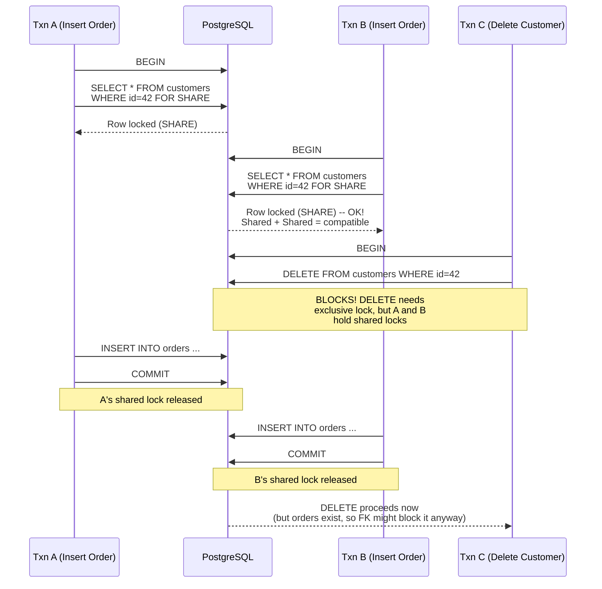

# Row-Level Locks & MVCC

How PostgreSQL coordinates concurrent access to the same rows.
Two mechanisms: **locks** (explicit coordination) and **MVCC** (implicit versioning).

---

## Row-Level Locks

When two transactions need to touch the same row, PostgreSQL uses row-level locks to
coordinate. There are two flavors you need to know, and two more PostgreSQL-specific
optimizations.

### Shared vs Exclusive

| Lock Type | SQL | What It Means |
|-----------|-----|---------------|
| **Shared** | `SELECT ... FOR SHARE` | "I'm reading this row -- don't delete or modify it, but others can read too" |
| **Exclusive** | `SELECT ... FOR UPDATE` | "I'm about to modify this row -- nobody else can touch it" |

PostgreSQL also has two finer-grained variants:

| Lock Type | SQL | Use Case |
|-----------|-----|----------|
| **FOR NO KEY UPDATE** | `SELECT ... FOR NO KEY UPDATE` | Like FOR UPDATE, but allows concurrent FOR KEY SHARE (useful when you're updating non-key columns) |
| **FOR KEY SHARE** | `SELECT ... FOR KEY SHARE` | Like FOR SHARE, but only protects the key columns from being changed (used internally by foreign key checks) |

### The Compatibility Matrix

This is the core mental model. "Can two transactions hold these locks on the **same row**
at the same time?"

| Requested \ Held | FOR KEY SHARE | FOR SHARE | FOR NO KEY UPDATE | FOR UPDATE |
|-------------------|:---:|:---:|:---:|:---:|
| **FOR KEY SHARE** | Yes | Yes | Yes | **No** |
| **FOR SHARE** | Yes | Yes | **No** | **No** |
| **FOR NO KEY UPDATE** | Yes | **No** | **No** | **No** |
| **FOR UPDATE** | **No** | **No** | **No** | **No** |

The pattern: FOR UPDATE conflicts with everything (including itself). FOR KEY SHARE is the most permissive.
As you go from top-left to bottom-right, compatibility shrinks.


### Implicit vs Explicit Locks

Not every statement requires you to write `FOR UPDATE`. PostgreSQL takes locks
automatically for data-modifying statements:

| Statement | Lock Taken | You Write It? |
|-----------|-----------|---------------|
| `SELECT` (plain) | **No lock at all** (uses MVCC -- see below) | -- |
| `SELECT ... FOR SHARE` | Shared (row-level) | Explicit |
| `SELECT ... FOR UPDATE` | Exclusive (row-level) | Explicit |
| `UPDATE` | Exclusive (row-level) | Implicit -- PostgreSQL does it for you |
| `DELETE` | Exclusive (row-level) | Implicit -- PostgreSQL does it for you |

Key takeaway: `UPDATE` and `DELETE` **automatically** take exclusive row locks.
You don't need `SELECT ... FOR UPDATE` followed by `UPDATE` -- the `UPDATE` itself
locks the row. You use `FOR UPDATE` when you need to lock the row **before** deciding
what to do (read-then-write pattern).

### Example: FOR SHARE -- Protecting a Foreign Key Reference

Scenario: You're inserting an order for customer 42. You want to make sure the customer
doesn't get deleted between your check and your insert.

```sql
-- Transaction A: inserting an order
BEGIN;
SELECT * FROM customers WHERE id = 42 FOR SHARE;
-- Customer 42 is now locked with a shared lock.
-- Nobody can DELETE or UPDATE it, but other transactions CAN also FOR SHARE it.
INSERT INTO orders (customer_id, amount) VALUES (42, 99.99);
COMMIT;
```

```sql
-- Transaction B (concurrent): also inserting an order for same customer
BEGIN;
SELECT * FROM customers WHERE id = 42 FOR SHARE;
-- This succeeds! Multiple shared locks can coexist.
INSERT INTO orders (customer_id, amount) VALUES (42, 50.00);
COMMIT;
```

```sql
-- Transaction C (concurrent): trying to delete that customer
BEGIN;
DELETE FROM customers WHERE id = 42;
-- BLOCKS here! DELETE needs an exclusive lock, but A and B hold shared locks.
-- C waits until both A and B commit.
```



### Example: FOR UPDATE -- Bank Balance Debit

Scenario: Two ATMs try to debit the same account at the same time. Without locking,
both read $1000, both debit $800, both write $200. The bank loses $800.

```sql
-- Transaction A: ATM debit
BEGIN;
SELECT balance FROM accounts WHERE id = 1 FOR UPDATE;
-- Returns $1000. Row is now exclusively locked.
-- Nobody else can read FOR UPDATE or modify this row until we're done.
UPDATE accounts SET balance = balance - 800 WHERE id = 1;
COMMIT;
```

```sql
-- Transaction B: concurrent ATM debit (arrives moments later)
BEGIN;
SELECT balance FROM accounts WHERE id = 1 FOR UPDATE;
-- BLOCKS here until A commits.
-- After A commits, B sees $200 (the updated balance).
-- B can then decide: is $200 enough for the requested debit?
```

Without `FOR UPDATE`, both transactions would read $1000 and both would succeed --
a classic lost update.

---

## MVCC (Multi-Version Concurrency Control)

This is the reason plain `SELECT` doesn't take any locks and never blocks.

### The Core Idea

Instead of locking rows so readers wait for writers, PostgreSQL keeps **multiple versions**
of each row. Think of it like Kafka's append-only log:

- `UPDATE` doesn't overwrite the old row. It creates a **new version** and marks the
  old one as expired.
- `SELECT` reads whichever version was valid at the "right point in time" (depends on
  isolation level -- see [02-isolation-levels.md](02-isolation-levels.md)).
- Old versions are cleaned up later by `VACUUM`.

```mermaid
graph LR
    subgraph "Row versions for account id=1"
        V1["Version 1<br/>balance = 1000<br/>created: T100<br/>expired: T105"]
        V2["Version 2<br/>balance = 200<br/>created: T105<br/>expired: --"]
    end

    A["Txn A (started T103)<br/>SELECT balance ..."] -.->|"Sees V1<br/>(was valid at T103)"| V1
    B["Txn B (started T110)<br/>SELECT balance ..."] -.->|"Sees V2<br/>(current version)"| V2
    VACUUM["VACUUM<br/>(eventually)"] -->|"Cleans up V1<br/>when no txn needs it"| V1

    style V1 fill:#4a3a1a,stroke:#ffaa44
    style V2 fill:#1a3a1a,stroke:#66ff66
```



### Why This Matters

- **Readers never block writers.** Your `SELECT` doesn't stop an `UPDATE` from proceeding.
- **Writers never block readers.** An ongoing `UPDATE` doesn't make your `SELECT` wait.
- The only thing that blocks is **writer vs writer** -- two transactions trying to
  `UPDATE` the same row. The second one waits for the first to commit or rollback.

This is fundamentally different from MySQL's default (InnoDB), where reads *can* take
shared locks under certain isolation levels.

---

## Table-Level Locks (Brief Mention)

These exist but are rarely something you'd use directly in application code.

| Lock | When It's Used |
|------|---------------|
| `ACCESS SHARE` | Taken automatically by `SELECT` -- prevents the table from being dropped while you're reading |
| `ACCESS EXCLUSIVE` | Taken by `ALTER TABLE`, `DROP TABLE` -- blocks everything |
| `SHARE` | Sometimes used for schema migrations that need a consistent snapshot |

**For interviews:** you should know table-level locks exist and are used for DDL
operations (schema changes, migrations). You don't need to memorize the full matrix.
The row-level stuff above is what matters for system design discussions.
