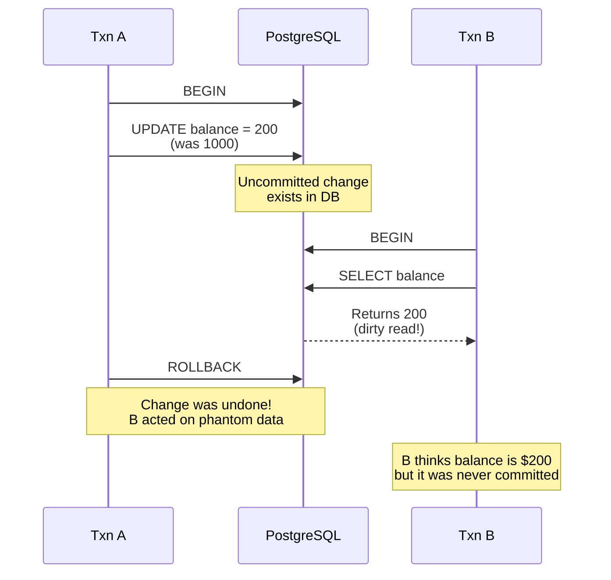
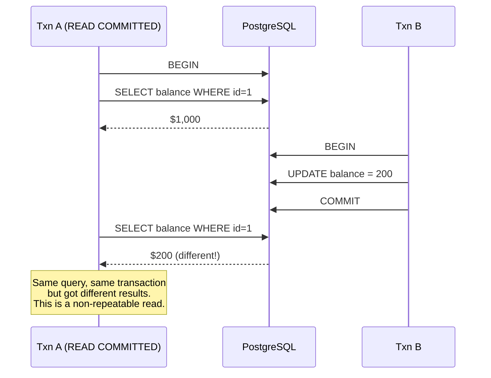
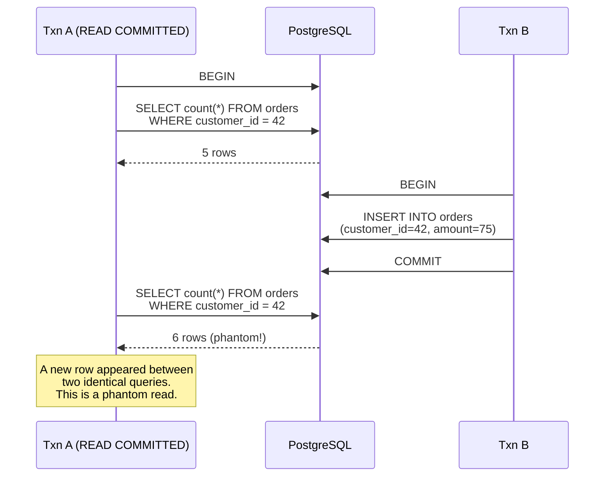
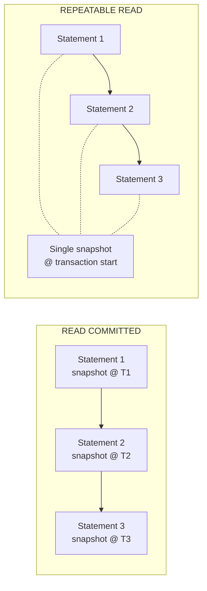

# Isolation Levels

Isolation levels control **what a transaction can see** of other transactions' changes.
PostgreSQL supports four levels, matching the SQL standard.

---

## The Mnemonic

**"Uncle Carl Rarely Showers"**

| Level | Short | Mnemonic Word |
|-------|-------|---------------|
| READ UNCOMMITTED | RU | **U**ncle |
| READ COMMITTED | RC | **C**arl |
| REPEATABLE READ | RR | **R**arely |
| SERIALIZABLE | S | **S**howers |

## The Google Docs Analogy

Think of a shared Google Doc being edited by multiple people:

| Isolation Level | Google Docs Version |
|----------------|---------------------|
| **READ UNCOMMITTED** | You see everyone's keystrokes in real time -- even half-typed words and things they're about to undo |
| **READ COMMITTED** | You only see saved versions of the doc. But the doc can update between your reads -- you might see different content each time you look |
| **REPEATABLE READ** | You downloaded a PDF when your transaction started. Your copy never changes, no matter what others do to the live doc |
| **SERIALIZABLE** | Everyone takes turns editing. Only one person can work at a time. Maximum consistency, minimum throughput |

---

## The Three Problems

Each isolation level protects against progressively more anomalies. Think of it as a
staircase -- each level adds protection on top of the previous one.

| Problem | READ UNCOMMITTED | READ COMMITTED | REPEATABLE READ | SERIALIZABLE |
|---------|:---:|:---:|:---:|:---:|
| Dirty reads | Possible | **Prevented** | Prevented | Prevented |
| Non-repeatable reads | Possible | Possible | **Prevented** | Prevented |
| Phantom reads | Possible | Possible | Possible* | **Prevented** |

*PostgreSQL bonus: its REPEATABLE READ implementation **also** prevents phantom reads
(the SQL standard doesn't require this, but PostgreSQL does it anyway). Great interview tidbit.

```mermaid
graph TD
    RU["READ UNCOMMITTED<br/>No protection"] -->|"+ prevents dirty reads"| RC["READ COMMITTED<br/>(PostgreSQL default)"]
    RC -->|"+ prevents non-repeatable reads"| RR["REPEATABLE READ"]
    RR -->|"+ prevents phantom reads<br/>(and serialization anomalies)"| S["SERIALIZABLE"]

    style RU fill:#4a1a1a,stroke:#ff6666
    style RC fill:#4a3a1a,stroke:#ffaa44
    style RR fill:#2a3a1a,stroke:#aaff44
    style S fill:#1a3a1a,stroke:#66ff66
```



---

### Problem 1: Dirty Reads

Reading data that another transaction hasn't committed yet. That transaction might
rollback, meaning you acted on data that never officially existed.

```sql
-- Transaction A
BEGIN;
UPDATE accounts SET balance = 200 WHERE id = 1;  -- was 1000
-- A has NOT committed yet

-- Transaction B (READ UNCOMMITTED)
SELECT balance FROM accounts WHERE id = 1;
-- Returns 200 (the uncommitted value!) -- this is a dirty read

-- Transaction A
ROLLBACK;  -- A undoes the change
-- B just acted on a balance of $200 that never actually happened
```



**PostgreSQL note:** READ UNCOMMITTED is not actually implemented. If you set it,
PostgreSQL silently upgrades you to READ COMMITTED. So dirty reads **cannot happen**
in PostgreSQL.

---

### Problem 2: Non-Repeatable Reads

Same query, same transaction, different results. Another transaction committed a change
between your two reads.

The classic bank balance example:

```sql
-- Transaction A (READ COMMITTED)
BEGIN;
SELECT balance FROM accounts WHERE id = 1;
-- Returns $1000

-- Transaction B (concurrent)
BEGIN;
UPDATE accounts SET balance = 200 WHERE id = 1;
COMMIT;  -- B commits the change

-- Back to Transaction A
SELECT balance FROM accounts WHERE id = 1;
-- Returns $200!  Same query, different result.
-- If A was computing something based on the first read, it's now inconsistent.
```



**How READ COMMITTED works in PostgreSQL:** each **statement** gets its own snapshot.
So the second `SELECT` sees B's committed change because it takes a fresh snapshot.

**How REPEATABLE READ prevents this:** the entire transaction gets **one snapshot** at
the start. All reads see the database as it was at that moment, regardless of what
commits happen after.

---

### Problem 3: Phantom Reads

New rows appear (or disappear) between two identical queries. Not about a row *changing*,
but about the *set of rows* changing.

```sql
-- Transaction A (READ COMMITTED)
BEGIN;
SELECT count(*) FROM orders WHERE customer_id = 42;
-- Returns 5

-- Transaction B (concurrent)
BEGIN;
INSERT INTO orders (customer_id, amount) VALUES (42, 75.00);
COMMIT;

-- Back to Transaction A
SELECT count(*) FROM orders WHERE customer_id = 42;
-- Returns 6!  A "phantom" row appeared.
```



**How SERIALIZABLE prevents this:** it uses **predicate locking** -- it doesn't just lock
existing rows, it locks the *condition* (`WHERE customer_id = 42`). Any INSERT that
matches that condition will conflict. This is fundamentally different from row-level
locks, which can only lock rows that already exist.

---

## Snapshot Behavior: Per-Statement vs Per-Transaction

This is the key implementation detail that differentiates the levels.

| Level | Snapshot Taken | What You See |
|-------|---------------|-------------|
| **READ COMMITTED** | At the start of **each statement** | Latest committed data at time of each query |
| **REPEATABLE READ** | At the start of **the transaction** | Frozen view from transaction start |
| **SERIALIZABLE** | At the start of **the transaction** + conflict detection | Frozen view + abort if conflict detected |



---

## Tradeoffs: Why READ COMMITTED is the Default

If REPEATABLE READ and SERIALIZABLE are safer, why doesn't everyone use them?

### The Core Tradeoff: Wait vs Abort

| | READ COMMITTED + FOR UPDATE | REPEATABLE READ |
|---|---|---|
| **On conflict** | Waits for the other transaction to finish | **Aborts** your transaction (serialization error) |
| **App code needed** | None -- the transaction just waits in line | **Retry loop** required to handle aborts |
| **Throughput** | Lower when conflicts are frequent (transactions queue up) | Higher when conflicts are rare (no waiting) |
| **Stale data risk** | Minimal (each statement sees latest committed data) | Possible (you see a snapshot from transaction start) |
| **When to use** | Most OLTP workloads, short transactions | Long-running reads, reporting, financial consistency |

### Why RC + FOR UPDATE Wins for Most Teams

1. **Most transactions are short.** A web request that takes 50ms is unlikely to have
   another transaction sneak in between reads.

2. **No retry logic.** With REPEATABLE READ, your app needs to catch serialization errors
   and retry. That's extra code, extra testing, extra things to get wrong.

3. **Surgical precision.** Instead of upgrading isolation for the entire transaction,
   teams use `SELECT ... FOR UPDATE` on the specific rows that need protection. This
   locks only what matters and leaves everything else at READ COMMITTED.

4. **VACUUM pressure.** REPEATABLE READ keeps old row versions alive longer (your
   snapshot needs them). More old versions means more work for VACUUM, which means
   more I/O overhead.

```mermaid
flowchart TD
    Q{"Do concurrent transactions<br/>conflict on the same rows?"} -->|Rarely| RC["READ COMMITTED<br/>(default, no special handling)"]
    Q -->|"Yes, specific rows"| RCFU["READ COMMITTED<br/>+ FOR UPDATE on those rows"]
    Q -->|"Yes, complex patterns<br/>across many rows"| RR["Consider REPEATABLE READ<br/>(with retry logic)"]
    Q -->|"Need full correctness<br/>guarantees"| S["SERIALIZABLE<br/>(with retry logic)"]

    style RC fill:#1a3a1a,stroke:#66ff66
    style RCFU fill:#2a3a1a,stroke:#aaff44
    style RR fill:#4a3a1a,stroke:#ffaa44
    style S fill:#4a1a1a,stroke:#ff6666
```



---

## Quick Reference

```mermaid
graph TD
    subgraph "What protects data integrity?"
        RL["Row-Level Locks<br/>(FOR UPDATE, FOR SHARE)<br/>Explicit coordination"]
        MVCC["MVCC<br/>(multi-version rows)<br/>Readers never block"]
        IL["Isolation Levels<br/>(RC, RR, S)<br/>What can you see?"]
    end

    RL -->|"Controls"| WW["Writer vs Writer<br/>conflicts"]
    MVCC -->|"Enables"| RW["Reader vs Writer<br/>no blocking"]
    IL -->|"Controls"| VIS["Visibility of<br/>other txns' changes"]

    style RL fill:#1a3a4a,stroke:#44aaff
    style MVCC fill:#1a3a1a,stroke:#66ff66
    style IL fill:#4a3a1a,stroke:#ffaa44
```



| Situation | Tool to Reach For |
|-----------|-------------------|
| Two transactions updating the same row | `SELECT ... FOR UPDATE` (or just rely on `UPDATE`'s implicit lock) |
| Protecting a row from deletion while referencing it | `SELECT ... FOR SHARE` |
| Need consistent reads across multiple statements | REPEATABLE READ isolation |
| Need full serializability guarantees | SERIALIZABLE isolation (with retry logic) |
| Plain reads alongside writes | Just use `SELECT` -- MVCC handles it, no lock needed |
