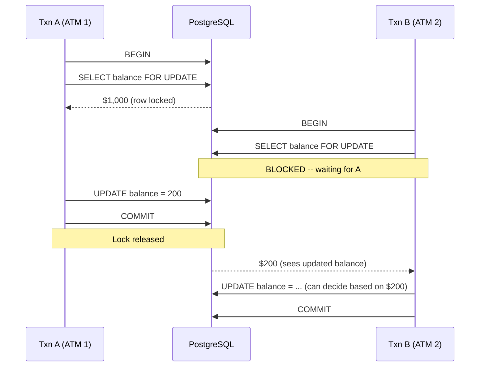

# Optimistic vs Pessimistic Locking

Two philosophies for handling concurrent modifications to the same data.

---

## Pessimistic Locking

**"I expect a conflict, so I'll lock the row upfront."**

This is `SELECT ... FOR UPDATE` -- grab the exclusive lock before doing any work.

```sql
BEGIN;
SELECT balance FROM accounts WHERE id = 42 FOR UPDATE;  -- lock NOW
-- Nobody else can touch this row until we're done
UPDATE accounts SET balance = balance - 800 WHERE id = 42;
COMMIT;  -- lock released
```



### When to Use Pessimistic

- Conflicts are **frequent** (many transactions hitting the same rows)
- Operations are **fast** (milliseconds -- lock is held briefly)
- You need a **guarantee** of success on first try (no retries)
- Example: bank debits, inventory decrements, counter updates

---

## Optimistic Locking

**"Conflicts are rare, so I won't lock anything. I'll check at write time."**

Add a `version` column to the table. On update, check that the version hasn't changed.

```sql
-- Schema
CREATE TABLE articles (
    id INT PRIMARY KEY,
    content TEXT,
    version INT DEFAULT 1
);
```

```sql
-- Step 1: Read (no lock, no long transaction)
SELECT content, version FROM articles WHERE id = 7;
-- Returns: version = 3

-- ... user edits for 5 minutes (no connection held, no lock) ...

-- Step 2: Update with version check
UPDATE articles
SET content = 'new content', version = version + 1
WHERE id = 7 AND version = 3;

-- If 0 rows affected → someone else changed it, retry or notify user
-- If 1 row affected → success, version is now 4
```



```mermaid
sequenceDiagram
    participant A as User A
    participant DB as PostgreSQL
    participant B as User B

    A->>DB: SELECT content, version FROM articles WHERE id=7
    DB-->>A: version = 3

    B->>DB: SELECT content, version FROM articles WHERE id=7
    DB-->>B: version = 3

    Note over A: Editing for 5 minutes...<br/>No lock held, no connection held

    B->>DB: UPDATE ... SET version=4<br/>WHERE id=7 AND version=3
    DB-->>B: 1 row affected ✅

    A->>DB: UPDATE ... SET version=4<br/>WHERE id=7 AND version=3
    DB-->>A: 0 rows affected ❌<br/>(version is now 4, not 3)

    Note over A: Conflict detected!<br/>Re-read and retry (or show user a merge UI)
```

### When to Use Optimistic

- Conflicts are **rare** (users mostly editing different data)
- Operations span **user think time** (seconds, minutes)
- You can tolerate **retries** or showing a conflict UI
- Example: wiki edits, config updates, form submissions, CMS

---

## The Key Difference: Resource Usage

The real reason to choose one over the other isn't about which is "safer" -- both
detect conflicts. It's about **what the server holds** during the operation.

```mermaid
graph TD
    subgraph "Pessimistic (5-min user edit)"
        PA["SELECT ... FOR UPDATE"] --> PB["DB connection HELD<br/>Row lock HELD<br/>Transaction OPEN"]
        PB -->|"5 minutes..."| PC["UPDATE + COMMIT<br/>Lock released"]
    end

    subgraph "Optimistic (5-min user edit)"
        OA["SELECT (2ms)"] --> OB["Connection returned ✅<br/>No lock ✅<br/>No transaction ✅"]
        OB -->|"5 minutes..."| OC["UPDATE WHERE version=N (2ms)<br/>Check rows affected"]
    end

    style PB fill:#4a1a1a,stroke:#ff6666
    style OB fill:#1a3a1a,stroke:#66ff66
```



| | Pessimistic | Optimistic |
|--|------------|-----------|
| **Lock duration** | Entire operation (read → think → write) | Zero |
| **DB connection held** | Entire operation | Only during read and write queries |
| **On conflict** | Other transaction **waits** | Your transaction **retries** |
| **Best for** | Fast, high-contention operations | Slow, low-contention operations |
| **Scalability** | Limited by lock duration and connection pool | Scales well (no resources held) |

---

## Version Column vs Timestamp

Some teams use `updated_at` instead of an integer `version`. This has a subtle problem:

```
Txn A reads:  updated_at = 2024-01-15 10:30:00.000
Txn B updates: updated_at = 2024-01-15 10:30:00.000  ← same millisecond!
Txn A updates: WHERE updated_at = 2024-01-15 10:30:00.000
               → 1 row affected 😱 conflict MISSED
```

An integer version is immune -- `version + 1` is always different from `version`.

| Approach | Collision risk | Clock dependent |
|----------|---------------|----------------|
| `version INT` | Zero | No |
| `updated_at TIMESTAMP` | Same-millisecond updates | Yes |
| `epoch BIGINT` (nanoseconds) | Extremely unlikely | Yes |

**Always prefer an integer version column for optimistic locking.**

---

## Decision Guide

```mermaid
flowchart TD
    Q1{"How long does the operation take?"} -->|"Milliseconds<br/>(DB transaction)"| Q2{"How often do conflicts happen?"}
    Q1 -->|"Seconds/minutes<br/>(user think time)"| OPT["Optimistic Locking<br/>(version column)"]

    Q2 -->|"Frequently<br/>(same rows, high traffic)"| PESS["Pessimistic Locking<br/>(FOR UPDATE)"]
    Q2 -->|"Rarely<br/>(different rows usually)"| EITHER["Either works.<br/>Optimistic is lighter."]

    style OPT fill:#1a3a1a,stroke:#66ff66
    style PESS fill:#1a3a4a,stroke:#44aaff
    style EITHER fill:#2a3a1a,stroke:#aaff44
```


