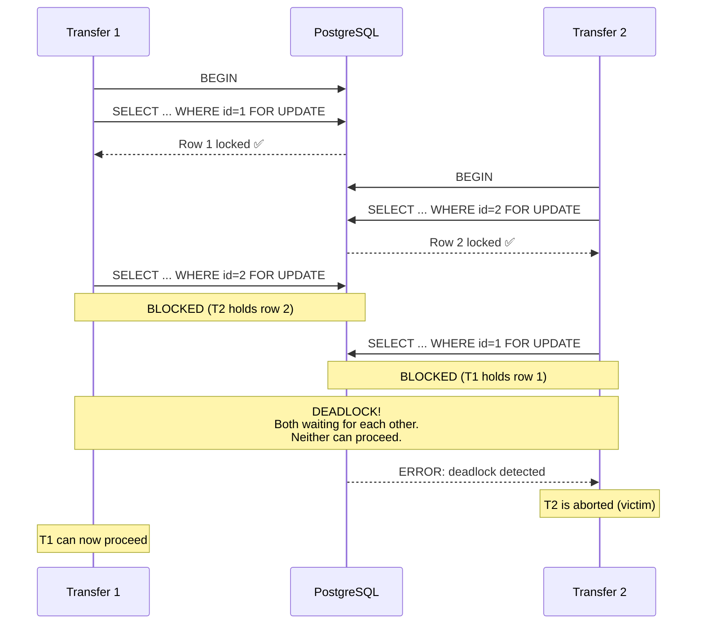
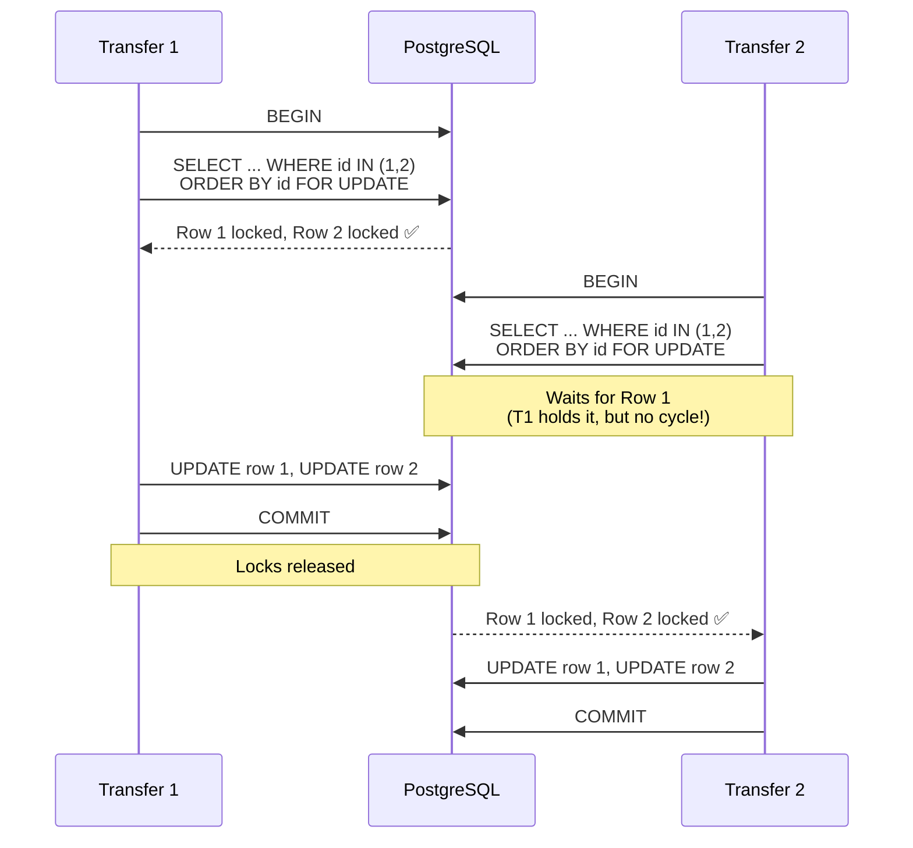

# Deadlocks

When two transactions each hold a lock the other needs, neither can proceed.

---

## The Classic Example: Money Transfer

Two transfers happening simultaneously, locking rows in **different order**:

```sql
-- Transfer 1: Account 1 → Account 2
BEGIN;
SELECT * FROM accounts WHERE id = 1 FOR UPDATE;  -- ✅ locks row 1
SELECT * FROM accounts WHERE id = 2 FOR UPDATE;  -- ❌ BLOCKED (Transfer 2 holds row 2)

-- Transfer 2: Account 2 → Account 1  (at the same time)
BEGIN;
SELECT * FROM accounts WHERE id = 2 FOR UPDATE;  -- ✅ locks row 2
SELECT * FROM accounts WHERE id = 1 FOR UPDATE;  -- ❌ BLOCKED (Transfer 1 holds row 1)
```

Neither can proceed. This is a deadlock.

```mermaid
graph LR
    T1["Transfer 1"] -->|"holds lock on"| R1["Row 1"]
    T1 -->|"waiting for"| R2["Row 2"]
    T2["Transfer 2"] -->|"holds lock on"| R2
    T2 -->|"waiting for"| R1

    style T1 fill:#4a1a1a,stroke:#ff6666
    style T2 fill:#4a1a1a,stroke:#ff6666
    style R1 fill:#1a3a4a,stroke:#44aaff
    style R2 fill:#1a3a4a,stroke:#44aaff
```





---

## Prevention: Consistent Lock Ordering

The fix is simple: **always lock rows in the same order** regardless of the operation.

Sort by ID (or any deterministic key). Both transfers lock the lower ID first:

```sql
-- Both transfers, regardless of direction:
BEGIN;
SELECT * FROM accounts WHERE id IN (1, 2) ORDER BY id FOR UPDATE;
-- Always locks row 1 first, then row 2
UPDATE accounts SET balance = balance - 100 WHERE id = 1;
UPDATE accounts SET balance = balance + 100 WHERE id = 2;
COMMIT;
```

Now if Transfer 2 needs rows 1 and 2, it locks row 1 first. If Transfer 1 already holds
row 1, Transfer 2 simply **waits** -- and Transfer 1 proceeds to lock row 2 without
anyone blocking it. No cycle, no deadlock.



---

## Detection: PostgreSQL's Safety Net

Even with careful coding, deadlocks can slip through. PostgreSQL has a built-in
deadlock detector as a safety net.

### How It Works

PostgreSQL uses a **wait-for graph** -- a directed graph where each edge means
"Transaction A is waiting for Transaction B." When `deadlock_timeout` expires,
PostgreSQL walks this graph looking for **cycles** (A → B → C → A). If it finds one,
it picks a victim (typically the transaction that's done the least work) and aborts it.

This is the same algorithm as cycle detection in a directed graph (DFS with a visited set) --
a classic graph algorithm problem.

**Further reading:**
- [PostgreSQL docs: Deadlocks](https://www.postgresql.org/docs/current/explicit-locking.html#LOCKING-DEADLOCKS)
- [PostgreSQL docs: deadlock_timeout](https://www.postgresql.org/docs/current/runtime-config-locks.html#GUC-DEADLOCK-TIMEOUT)
- [PostgreSQL wiki: Lock Monitoring](https://wiki.postgresql.org/wiki/Lock_Monitoring)

Two configuration parameters:

| Setting | What It Does | Default |
|---------|-------------|---------|
| `deadlock_timeout` | How long to wait before **checking** for a deadlock cycle | 1 second |
| `lock_timeout` | Hard cap on **any** lock wait, deadlock or not | 0 (wait forever) |

**`deadlock_timeout`** is NOT "abort after this long." It's "wait this long before
running the deadlock detector." PostgreSQL thinks: "maybe this is just normal waiting.
I'll give it 1 second. If it's still stuck, I'll check for a cycle." If a cycle is found,
one transaction is killed. If no cycle, waiting continues.

**`lock_timeout`** is the hard limit. Regardless of whether there's a deadlock, if a
transaction has been waiting longer than this, it's killed. Useful for preventing any
request from hanging indefinitely.

```mermaid
flowchart TD
    W["Transaction waiting for a lock..."] --> DT{"deadlock_timeout<br/>reached? (1s)"}
    DT -->|"No"| W
    DT -->|"Yes"| CHECK{"Run deadlock<br/>detector"}
    CHECK -->|"Cycle found"| KILL["Kill one transaction<br/>(the 'victim')"]
    CHECK -->|"No cycle"| WAIT{"lock_timeout<br/>reached?"}
    WAIT -->|"No"| W
    WAIT -->|"Yes"| ABORT["Abort: lock timeout exceeded"]
    WAIT -->|"No timeout set"| W2["Keep waiting forever..."]

    style KILL fill:#4a1a1a,stroke:#ff6666
    style ABORT fill:#4a3a1a,stroke:#ffaa44
```



### Production Setup

A common configuration:

```sql
-- Check for deadlocks after 1 second of waiting
SET deadlock_timeout = '1s';

-- Never wait more than 5 seconds for any lock
SET lock_timeout = '5s';
```

---

## Two Strategies

| Strategy | How | Who Does It |
|----------|-----|-------------|
| **Prevention** | Always lock rows in consistent order (sort by ID) | Your app code |
| **Detection** | Deadlock detector kills one transaction after timeout | PostgreSQL (automatic) |

In practice, you do **both** -- prevent where you can with consistent ordering,
and rely on PostgreSQL's deadlock detector as a safety net for cases you missed.

---

## Deadlock Detection in Application Code

Databases detect deadlocks for you. Application-level threading does not.

| | Python | Go | PostgreSQL |
|--|--------|-----|-----------|
| **Detects deadlocks?** | No | Only if ALL goroutines stuck | Yes (active cycle detector) |
| **Prevention tools** | `lock.acquire(timeout=N)` | `context.WithTimeout` | Consistent lock ordering |
| **On deadlock** | Hangs silently forever | Hangs (or panic if all goroutines stuck) | Kills one transaction with error |

Python's `threading.Lock` has no deadlock detection. If two threads deadlock, the program
hangs silently. The only tool is `acquire(timeout=5)` which lets you bail out after a
timeout -- but that's a timeout, not detection.

Go's runtime detects when **all** goroutines are blocked (`fatal error: all goroutines
are asleep - deadlock!`), but if even one goroutine is alive (e.g., an HTTP server),
the deadlock among other goroutines goes undetected.

**Takeaway:** Databases are the only layer that actively detects and resolves deadlocks.
In application code, prevention (consistent lock ordering) is your only reliable tool.
