# SKIP LOCKED & NOWAIT

Variants of `FOR UPDATE` that change what happens when a row is already locked.

---

## The Problem: Hot Row Contention

100 users booking seats for a movie. Without SKIP LOCKED, they all try to lock the
same row (the first available seat). 99 users block, waiting in line:

```sql
-- Without SKIP LOCKED: everyone fights for seat 1
SELECT * FROM seats WHERE movie_id = 5 AND status = 'available'
ORDER BY seat_number LIMIT 1 FOR UPDATE;
-- User 1: locks seat 1 ✅
-- Users 2-100: BLOCKED, waiting for seat 1 🐌
```

---

## The Three Variants

| Variant | On locked row... | Use when |
|---------|-----------------|----------|
| `FOR UPDATE` | **Wait** until lock is released | You need **that specific row** (bank balance, user profile) |
| `FOR UPDATE NOWAIT` | **Error immediately** (`could not obtain lock`) | You need that row but won't wait (fail fast) |
| `FOR UPDATE SKIP LOCKED` | **Skip it**, try the next matching row | Any matching row is fine (seat booking, job queue) |

---

## SKIP LOCKED: Parallel Access Without Blocking

```sql
-- With SKIP LOCKED: each user grabs a different seat
SELECT * FROM seats WHERE movie_id = 5 AND status = 'available'
ORDER BY seat_number LIMIT 1 FOR UPDATE SKIP LOCKED;
-- User 1: locks seat 1 ✅
-- User 2: seat 1 locked, SKIP → locks seat 2 ✅
-- User 3: seats 1,2 locked, SKIP → locks seat 3 ✅
-- All 100 users proceed in parallel!
```



```mermaid
sequenceDiagram
    participant U1 as User 1
    participant DB as PostgreSQL
    participant U2 as User 2
    participant U3 as User 3

    U1->>DB: SELECT ... LIMIT 1 FOR UPDATE SKIP LOCKED
    DB-->>U1: Seat 1 (locked)

    U2->>DB: SELECT ... LIMIT 1 FOR UPDATE SKIP LOCKED
    Note over DB: Seat 1 locked → skip
    DB-->>U2: Seat 2 (locked)

    U3->>DB: SELECT ... LIMIT 1 FOR UPDATE SKIP LOCKED
    Note over DB: Seats 1,2 locked → skip
    DB-->>U3: Seat 3 (locked)

    Note over U1,U3: All three proceed in parallel!<br/>No blocking, no waiting.
```

### When SKIP LOCKED Works

It only works when **any matching row is equally good** -- you don't care which
specific one you get.

- ✅ Seat booking (any available seat is fine)
- ✅ Job queues (any pending job is fine)
- ✅ Task assignment (any unassigned task is fine)
- ❌ Bank balance debit (you need **that specific account**)
- ❌ User profile update (you need **that specific user**)

Using SKIP LOCKED on a bank balance would skip the row you need and return nothing!

---

## NOWAIT: Fail Fast

Instead of waiting or skipping, NOWAIT raises an error immediately:

```sql
SELECT * FROM accounts WHERE id = 42 FOR UPDATE NOWAIT;
-- If row is already locked:
-- ERROR: could not obtain lock on row in relation "accounts"
```

Useful when your app would rather show an error instantly than make the user wait.

---

## PostgreSQL as a Job Queue

`SKIP LOCKED` enables using PostgreSQL as a simple job/message queue -- no Kafka
or RabbitMQ needed.

```sql
-- Worker grabs the next available job
BEGIN;
SELECT * FROM jobs
WHERE status = 'pending'
ORDER BY created_at
LIMIT 1
FOR UPDATE SKIP LOCKED;

-- Process the job...

UPDATE jobs SET status = 'done' WHERE id = <job_id>;
COMMIT;
```

10 workers running this simultaneously each grab a different pending job.
No blocking, no duplicate processing.

```mermaid
graph LR
    subgraph "jobs table"
        J1["Job 1<br/>status: pending"]
        J2["Job 2<br/>status: pending"]
        J3["Job 3<br/>status: pending"]
    end

    W1[Worker 1] -->|"SKIP LOCKED"| J1
    W2[Worker 2] -->|"skip J1 →"| J2
    W3[Worker 3] -->|"skip J1,J2 →"| J3

    style J1 fill:#4a3a1a,stroke:#ffaa44
    style J2 fill:#4a3a1a,stroke:#ffaa44
    style J3 fill:#4a3a1a,stroke:#ffaa44
```



### Comparison: Python Message Queue vs PostgreSQL Job Queue

| Python Message Queue (03-simple-message-queue.py) | PostgreSQL Job Queue |
|---|---|
| `deque` with `threading.Lock` | `jobs` table with `FOR UPDATE SKIP LOCKED` |
| `receive()` pops from queue | `SELECT ... LIMIT 1 FOR UPDATE SKIP LOCKED` |
| `ack(receipt_id)` deletes from in-flight map | `UPDATE jobs SET status = 'done'` |
| Visibility timeout → requeue | Cron/worker requeues stale `in_progress` rows |
| `condition.wait()` when queue empty | Worker polls with `SELECT` in a loop (or `LISTEN/NOTIFY`) |
| In-memory only, single process | Persistent, survives restarts, multi-machine |

### When to Use PostgreSQL as a Queue

- ✅ Low to moderate throughput (hundreds/sec)
- ✅ Already have PostgreSQL, don't want another dependency
- ✅ Need transactional guarantees (job and data update in same transaction)
- ❌ High throughput (thousands+/sec) → use Kafka, RabbitMQ, SQS
- ❌ Need fan-out to multiple consumers → use a real message broker
- ❌ Need replay/rewind → use a stream (Kafka)

**Further reading:**
- [PostgreSQL docs: FOR UPDATE SKIP LOCKED](https://www.postgresql.org/docs/current/sql-select.html#SQL-FOR-UPDATE-SHARE)
- [Postgres as a job queue (blog)](https://webapp.io/blog/postgres-is-the-answer/)
