# SQL Data Types

A practical reference for system design -- which types to use, how much storage they cost, and the gotchas.

---

## Integer Types

| Type | Size | Range | Use case |
|------|------|-------|----------|
| `TINYINT` | 1 byte | -128 to 127 (0–255 unsigned) | Boolean flags, status codes |
| `SMALLINT` | 2 bytes | -32K to 32K | Port numbers, small counters |
| `MEDIUMINT` | 3 bytes | -8M to 8M | Medium counters (MySQL only) |
| `INT` | 4 bytes | ±2.1 **billion** | User IDs, most counters |
| `BIGINT` | 8 bytes | ±9.2 **quintillion** | Epoch timestamps, snowflake IDs |

**Rule of thumb:**

- Counting normal things (users, products)? → `INT`
- Timestamps, distributed IDs, massive scale? → `BIGINT`

---

## String Types

| Type | Max Size | Storage | Use case |
|------|----------|---------|----------|
| `CHAR(n)` | 255 bytes | Always `n` bytes (padded) | Fixed-length codes (`"US"`, `"USD"`) |
| `VARCHAR(n)` | 65,535 bytes* | Actual length + 1–2 bytes | Keys, emails, usernames |
| `TEXT` | 65 KB | Actual length + 2 bytes | Blog posts, descriptions |
| `MEDIUMTEXT` | 16 MB | Actual length + 3 bytes | Large documents |
| `LONGTEXT` | 4 GB | Actual length + 4 bytes | Huge blobs (rarely used) |

*\*VARCHAR max depends on row size limit*

**Key insight:** `VARCHAR(255)` storing `"hello"` uses **7 bytes** (5 + 2 length bytes), not 255. Only stores what it needs.

```mermaid
graph LR
    subgraph "CHAR(5) storing 'hi'"
        C1["h"] --- C2["i"] --- C3["_"] --- C4["_"] --- C5["_"]
    end
    subgraph "VARCHAR(5) storing 'hi'"
        V0["len=2"] --- V1["h"] --- V2["i"]
    end

    style C3 fill:#4a3a1a,stroke:#ffaa44
    style C4 fill:#4a3a1a,stroke:#ffaa44
    style C5 fill:#4a3a1a,stroke:#ffaa44
    style V0 fill:#1a3a4a,stroke:#44aaff
```



**Rule of thumb:** `VARCHAR` is the default. Use `CHAR` only for truly fixed-width data. Use `TEXT` when you can't predict length.

---

## Date/Time Types

| Type | Size | Stores | Example |
|------|------|--------|---------|
| `DATE` | 3 bytes | Date only | `2025-03-15` |
| `TIME` | 3 bytes | Time only | `14:30:00` |
| `DATETIME` | 8 bytes | Date + time, **no timezone** | `2025-03-15 14:30:00` |
| `TIMESTAMP` | 4 bytes | Date + time, stored as **UTC epoch** | 1970 – **2038** |

### The 2038 Problem

`TIMESTAMP` is stored as a 32-bit integer (seconds since 1970-01-01). It overflows on **January 19, 2038**.

```mermaid
graph LR
    A["1970-01-01<br/>epoch = 0"] --> B["2025-03-15<br/>epoch = 1,741,034,400"] --> C["2038-01-19<br/>epoch = 2,147,483,647<br/>💥 OVERFLOW"]
    style C fill:#4a1a1a,stroke:#ff4444
```



**Workaround:** Store epoch as `BIGINT` — good for billions of years.

### Getting Epoch in SQL

| Database | Function |
|----------|----------|
| MySQL | `UNIX_TIMESTAMP()` |
| PostgreSQL | `EXTRACT(EPOCH FROM NOW())::BIGINT` |

`NOW()` returns a datetime, not an integer. Can't compare directly with a `BIGINT` column.

---

## Floating Point Types

| Type | Size | Precision | Use case |
|------|------|-----------|----------|
| `FLOAT` | 4 bytes | ~7 digits | Approximate values (rarely used) |
| `DOUBLE` | 8 bytes | ~15 digits | Scientific, coordinates |
| `DECIMAL(m,d)` | Variable | **Exact** | **Money!** `DECIMAL(10,2)` → `99999999.99` |

**Golden rule:** Never use `FLOAT`/`DOUBLE` for money. Floating point rounding **will** bite you.

```
-- FLOAT: 0.1 + 0.2 = 0.30000000000000004  ❌
-- DECIMAL: 0.1 + 0.2 = 0.3                 ✅
```

---

## Binary & Blob Types

| Type | Max Size | Use case |
|------|----------|----------|
| `BINARY(n)` | 255 bytes | Fixed-length hashes, UUIDs |
| `VARBINARY(n)` | 65 KB | Variable binary data |
| `BLOB` | 65 KB | Small files (usually use S3 instead) |

---

## Boolean

`BOOLEAN` is `TINYINT(1)` under the hood. `0` = false, `1` = true.

---

## Quick Decision Guide

```mermaid
flowchart TD
    A[What are you storing?] --> B{Numbers?}
    A --> C{Text?}
    A --> D{Date/Time?}
    A --> E{Money?}

    B -->|"Counting things"| B1["INT (4 bytes)"]
    B -->|"Timestamps/IDs"| B2["BIGINT (8 bytes)"]
    B -->|"Flags"| B3["TINYINT (1 byte)"]

    C -->|"Fixed width<br/>(country codes)"| C1["CHAR(n)"]
    C -->|"Variable, bounded<br/>(keys, emails)"| C2["VARCHAR(n)"]
    C -->|"Unbounded text"| C3["TEXT"]

    D -->|"Need timezone"| D1["BIGINT epoch<br/>(avoids 2038)"]
    D -->|"Just a date"| D2["DATE"]

    E --> E1["DECIMAL(m,d)<br/>NEVER FLOAT"]

    style E1 fill:#4a1a1a,stroke:#ff4444
    style D1 fill:#1a3a4a,stroke:#44aaff
```


