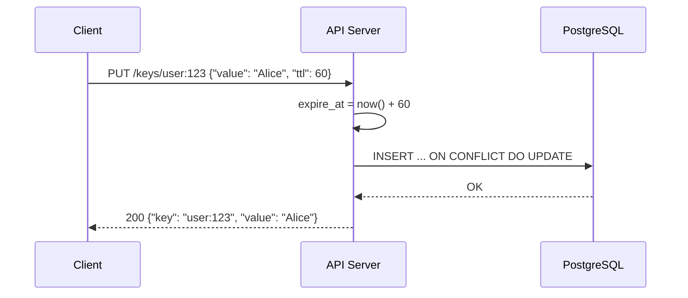
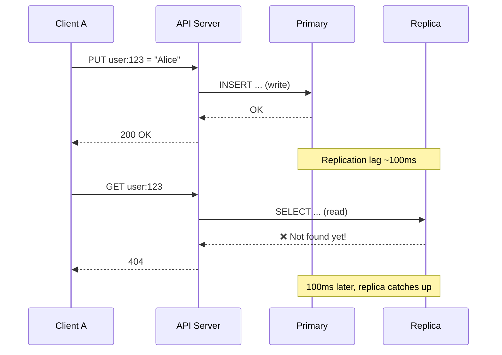
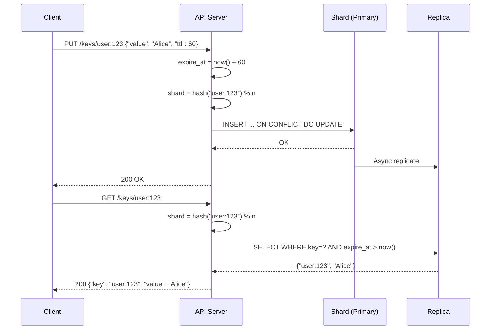

# Designing a Distributed KV Store on MySQL/PostgreSQL

A simplified Redis-like key-value store backed by a relational database.

---

## Requirements

- HTTP-based API: `PUT`, `GET`, `DELETE` with optional TTL
- All operations synchronous per key
- Horizontally scalable
- Durable (data survives restarts)

---

## Schema

```sql
CREATE TABLE store (
    key       VARCHAR(255) PRIMARY KEY,
    value     TEXT NOT NULL,
    expire_at BIGINT NOT NULL DEFAULT 0
);

-- Index for efficient cleanup queries
CREATE INDEX idx_store_expire_at ON store (expire_at);
```

### Design Decisions

| Decision | Choice | Why |
|----------|--------|-----|
| `key` type | `VARCHAR(255)` | Variable-length keys like `user:123:session` |
| `value` type | `TEXT` | Unbounded value size for general-purpose store |
| `expire_at` type | `BIGINT` | Epoch in seconds. Avoids 2038 `TIMESTAMP` overflow |
| Soft delete marker | `expire_at = -1` | Avoids extra `is_deleted` column. Epoch is always positive, so -1 is safe as sentinel |
| No-expiry marker | `expire_at = 0` | 0 means "lives forever" |

```mermaid
graph TD
    subgraph "store table"
        R1["key: user:1<br/>value: Alice<br/>expire_at: 1741034460"]
        R2["key: user:2<br/>value: Bob<br/>expire_at: 0 (never)"]
        R3["key: user:3<br/>value: Carol<br/>expire_at: -1 (deleted)"]
    end

    R1 -->|"GET user:1<br/>expire_at > now()?"| V1["✅ Returns Alice"]
    R2 -->|"GET user:2<br/>expire_at = 0 → never expires"| V2["✅ Returns Bob"]
    R3 -->|"GET user:3<br/>expire_at = -1, not > now()"| V3["❌ 404 Not Found"]

    style R3 fill:#4a1a1a,stroke:#ff4444
    style R2 fill:#1a4a1a,stroke:#44ff44
```



---

## Operations

### PUT (Upsert)

Client sends TTL in seconds (relative). API server converts to absolute epoch.

```
Client:  PUT /keys/user:123  { "value": "Alice", "ttl": 60 }
Server:  expire_at = UNIX_TIMESTAMP() + 60
```

```sql
-- PostgreSQL
INSERT INTO store (key, value, expire_at) VALUES ($1, $2, $3)
  ON CONFLICT (key) DO UPDATE SET value = $2, expire_at = $3;

-- MySQL
INSERT INTO store VALUES (?, ?, ?)
  ON DUPLICATE KEY UPDATE value = ?, expire_at = ?;
```

#### Why Upsert, Not SELECT + INSERT/UPDATE?

- Two separate queries = two round trips + needs a transaction for race safety
- Upsert = one atomic statement, one round trip

#### REPLACE INTO vs ON DUPLICATE KEY UPDATE

| | `REPLACE INTO` | `INSERT ... ON DUPLICATE KEY UPDATE` |
|---|---|---|
| Under the hood | DELETE + INSERT | Update in place |
| B+ tree impact | Rebalance twice (delete + insert) | No rebalance |
| WAL/redo log | Two entries | One entry |
| Performance | Baseline | **~32x faster** |

`REPLACE INTO` triggers the same B+ tree rebalancing cost we're trying to avoid with soft deletes.



### GET

```sql
SELECT key, value FROM store
  WHERE key = $1
    AND (expire_at > EXTRACT(EPOCH FROM NOW()) OR expire_at = 0);
```

Key insight: `expire_at = 0` means "never expires" so we must include it. Expired and soft-deleted keys (`expire_at <= now()` or `expire_at = -1`) are invisible to GET.

### DELETE (Soft Delete)

```sql
UPDATE store SET expire_at = -1
  WHERE key = $1
    AND (expire_at > EXTRACT(EPOCH FROM NOW()) OR expire_at = 0);
```

- Only soft-deletes keys that are currently **alive**
- Avoids unnecessary writes on already-expired rows (saves I/O at scale)
- No hard delete → no B+ tree rebalancing

---

## TTL & Garbage Collection

Two-pronged approach:

1. **Read-time filtering** — GET query ignores expired rows automatically
2. **Background CRON job** — hard-deletes expired + soft-deleted rows in batches

```sql
-- Cleanup: delete expired and soft-deleted rows
DELETE FROM store WHERE expire_at <= EXTRACT(EPOCH FROM NOW()) AND expire_at != 0
  LIMIT 1000;
```

### Why LIMIT 1000?

Without a limit, if 500K rows are expired:

- All 500K rows get exclusive locks in one transaction
- Massive WAL/redo log write
- B+ tree rebalancing hits all at once
- Replication lag spikes
- Other queries blocked while waiting for locks

**Small batches, frequent runs** — same total work, but the database stays responsive.

```mermaid
graph LR
    subgraph "❌ Without LIMIT"
        A1["DELETE 500K rows"] --> A2["Locks everything<br/>WAL spike<br/>Replication lag<br/>Other queries blocked"]
    end
    subgraph "✅ With LIMIT 1000"
        B1["DELETE 1000 rows"] --> B2["Quick commit"]
        B2 --> B3["DELETE 1000 rows"]
        B3 --> B4["Quick commit"]
        B4 --> B5["... repeat every t minutes"]
    end

    style A2 fill:#4a1a1a,stroke:#ff4444
    style B2 fill:#1a4a1a,stroke:#44ff44
    style B4 fill:#1a4a1a,stroke:#44ff44
```



---

## Scaling: Read/Write Splitting

Single database → read bottleneck under load. Classic solution: **replicas**.

- **Writes** (PUT, DELETE) → Primary/Master
- **Reads** (GET) → Replica(s)

KV stores are typically read-heavy (10–100x more reads than writes), so this helps enormously.

```mermaid
graph LR
    C[Client] --> API[KV API Server]
    API -->|"PUT / DELETE"| M[(Primary)]
    API -->|"GET"| R1[(Replica 1)]
    API -->|"GET"| R2[(Replica 2)]
    M -->|"async replication"| R1
    M -->|"async replication"| R2

    style M fill:#4a3a1a,stroke:#ffaa44
    style R1 fill:#1a3a4a,stroke:#44aaff
    style R2 fill:#1a3a4a,stroke:#44aaff
```



### The Problem: Replication Lag

Async replication is fast (~100ms–1s) but not instant. A client that writes and immediately reads may see stale data.



---

## Consistent Read Strategies

Four approaches, each with different tradeoffs:

### 1. Always Read from Primary

- ✅ Guaranteed consistent
- ❌ Primary overloaded — defeats the purpose of replicas

### 2. Synchronous Replication (Dual Write)

Write doesn't return until replica confirms.

- ✅ All reads consistent from any node
- ❌ 2x write latency (wait for replica round trip)
- ❌ Replica failure **blocks writes** (availability risk)

### 3. Client-Decided Consistency

Default reads go to replica. Client opts in to consistent reads:

```
GET /keys/user:123                    → replica (fast, maybe stale)
GET /keys/user:123?consistent=true    → primary (slower, always fresh)
```

DynamoDB's approach — consistent reads cost **3x**. Economic incentive to only use when needed.

### 4. Sticky Sessions (Read-Your-Own-Writes)

After a write, route **that client's** reads to primary for a short window (replication lag duration). Other clients still read from replicas.

- ✅ Only the writer pays the cost
- ❌ Routing complexity (need to track who wrote recently)

### Comparison

| Approach | Consistency | Cost |
|----------|------------|------|
| Always read from primary | ✅ All clients | Primary overloaded |
| Sync replication | ✅ All clients | 2x write latency, availability risk |
| Client-decided | ✅ Opt-in per request | 3x read cost, client complexity |
| Sticky sessions | ✅ Writer only | Routing logic, some primary read load |

```mermaid
flowchart TD
    A["Need consistent reads?"] -->|No| B["Read from replica<br/>(default, fast)"]
    A -->|Yes| C{"Which approach?"}

    C -->|"Simple"| D["Read from primary<br/>⚠️ Primary overload risk"]
    C -->|"Best UX"| E["Sticky sessions<br/>Route writer → primary briefly"]
    C -->|"Client controls"| F["?consistent=true<br/>DynamoDB-style, 3x cost"]
    C -->|"Always consistent"| G["Sync replication<br/>⚠️ 2x write latency"]

    style B fill:#1a4a1a,stroke:#44ff44
    style D fill:#4a3a1a,stroke:#ffaa44
    style G fill:#4a1a1a,stroke:#ff4444
```



---

## Scaling Writes: Sharding

One primary handles all writes → bottleneck. Solution: **shard** across multiple primaries.

```
shard_id = hash(key) % n
```

Each shard owns a subset of keys. Writes distributed evenly.

```mermaid
graph TD
    C[Client] --> API[API Server]
    API -->|"hash(key) % 3 = 0"| S0["Shard 0<br/>Primary + Replicas"]
    API -->|"hash(key) % 3 = 1"| S1["Shard 1<br/>Primary + Replicas"]
    API -->|"hash(key) % 3 = 2"| S2["Shard 2<br/>Primary + Replicas"]

    style S0 fill:#4a3a1a,stroke:#ffaa44
    style S1 fill:#1a3a4a,stroke:#44aaff
    style S2 fill:#1a4a3a,stroke:#44ffaa
```



### The Resharding Problem

Adding a 4th shard changes `n` from 3 to 4 → **most keys rehash to different shards**. Massive data migration required.

**Solution:** Consistent hashing (separate deep dive).

---

## Concurrency: Why Upserts Are Safe

Two clients calling PUT on the same key simultaneously:

```
Client A: PUT user:123 = "Alice"
Client B: PUT user:123 = "Bob"      (at the same time)
```

Both MySQL and PostgreSQL use **pessimistic row-level locking** for concurrent writes:

1. Transaction A gets an **exclusive lock** on the row
2. Transaction B **waits** until A commits
3. Then B runs its update

This is safe because the lock is held for one tiny upsert — microseconds. No deadlock risk (single row, single statement).

| Scenario | What happens |
|----------|-------------|
| Two readers, same row | Both proceed (MVCC) |
| Reader + writer, same row | Both proceed (MVCC) |
| Two writers, same row | **Serialized** — one waits |

---

## Summary: Complete Request Flow



---

## Connections to Previous Topics

| KV Store Concept | Related Notes |
|---|---|
| Row locks on concurrent PUT | [Row-Level Locks & MVCC](01-row-level-locks.md) |
| Upsert avoids B+ tree rebalancing | [Optimistic vs Pessimistic Locking](03-optimistic-pessimistic-locking.md) |
| LIMIT on cleanup to avoid lock storms | [Deadlocks](04-deadlocks.md) |
| PG as job queue for cleanup CRON | [SKIP LOCKED & NOWAIT](05-skip-locked-and-nowait.md) |
| Data types for schema design | [SQL Data Types](06-sql-data-types.md) |
