# Non-Relational Databases

## Columnar Databases

### The Problem: Row Stores Waste I/O on Analytics

Consider a `stock_ticks` table:

| symbol | price | name       | exchange | timestamp  |
|--------|-------|------------|----------|------------|
| AAPL   | 142.50| Apple Inc  | NYSE     | 1772845000 |
| GOOG   | 89.20 | Alphabet   | NASDAQ   | 1772845001 |
| MSFT   | 315.00| Microsoft  | NYSE     | 1772845002 |

And a typical analytics query:

```sql
SELECT AVG(price) FROM stock_ticks
WHERE exchange = 'NYSE' AND timestamp > now() - interval '24 hours'
```

We only need 3 columns (`price`, `exchange`, `timestamp`) out of 5.
But in a row store, we read **all 5** — because of how data lives on disk.

---

### How Data is Stored on Disk

#### Row-Oriented (OLTP) — Postgres, MySQL

Data is stored **row by row**. Each disk page (~8KB) packs full rows together:

```
┌─────────────────── Disk Page 1 (8KB) ──────────────────────┐
│                                                             │
│  Row 1: [AAPL | 142.50 | Apple Inc  | NYSE   | 1772845000] │
│  Row 2: [GOOG |  89.20 | Alphabet   | NASDAQ | 1772845001] │
│  Row 3: [MSFT | 315.00 | Microsoft  | NYSE   | 1772845002] │
│  Row 4: [TSLA | 201.30 | Tesla Inc  | NASDAQ | 1772845003] │
│  ...                                                        │
└─────────────────────────────────────────────────────────────┘

┌─────────────────── Disk Page 2 (8KB) ──────────────────────┐
│                                                             │
│  Row 51: [AMZN | 178.90 | Amazon    | NASDAQ | 1772845050] │
│  Row 52: [META |  62.40 | Meta      | NASDAQ | 1772845051] │
│  ...                                                        │
└─────────────────────────────────────────────────────────────┘
```

**Reading `AVG(price) WHERE exchange = 'NYSE'`:**

- Must load every page into memory (full rows)
- Parse through `symbol`, `name` — columns we don't need
- With 500M rows × 5 columns → **3/5ths of disk I/O is wasted**
- With 80 columns and a 3-column query → **96% wasted**

✅ Great for: `SELECT * FROM users WHERE id = 42` (one read, full row)

❌ Bad for: Scanning millions of rows for aggregates

#### Column-Oriented (OLAP) — Redshift, BigQuery, ClickHouse

Data is stored **column by column**. Each column is its own file/segment:

```
┌──── symbol.col ─────┐  ┌──── price.col ─────┐  ┌──── name.col ──────────┐
│ AAPL                 │  │ 142.50              │  │ Apple Inc               │
│ GOOG                 │  │  89.20              │  │ Alphabet                │
│ MSFT                 │  │ 315.00              │  │ Microsoft               │
│ TSLA                 │  │ 201.30              │  │ Tesla Inc               │
│ AMZN                 │  │ 178.90              │  │ Amazon                  │
│ ...500M rows         │  │ ...500M rows        │  │ ...500M rows            │
└──────────────────────┘  └─────────────────────┘  └─────────────────────────┘

┌──── exchange.col ───┐  ┌──── timestamp.col ──┐
│ NYSE                │  │ 1772845000          │
│ NASDAQ              │  │ 1772845001          │
│ NYSE                │  │ 1772845002          │
│ NASDAQ              │  │ 1772845003          │
│ NASDAQ              │  │ 1772845050          │
│ ...500M rows        │  │ ...500M rows        │
└─────────────────────┘  └─────────────────────┘
```

**Reading `AVG(price) WHERE exchange = 'NYSE'`:**

- Read ONLY `price.col`, `exchange.col`, `timestamp.col`
- **Never touch** `symbol.col` or `name.col` — zero wasted I/O
- Only 3/5ths of total data read (exactly what we need)

✅ Great for: Aggregating millions of rows across a few columns

❌ Bad for: `SELECT * FROM stock_ticks WHERE symbol = 'AAPL' LIMIT 1`
(must read from 5 separate column files to reconstruct one row)

---

### Visualizing the Difference

```mermaid
graph LR
    subgraph "Row Store — Read Full Rows"
        direction TB
        P1["Page 1<br/>R1: all cols<br/>R2: all cols<br/>R3: all cols"]
        P2["Page 2<br/>R4: all cols<br/>R5: all cols<br/>R6: all cols"]
    end

    subgraph "Column Store — Read Only Needed Columns"
        direction TB
        C1["price.col<br/>142.50<br/>89.20<br/>315.00<br/>..."]
        C2["exchange.col<br/>NYSE<br/>NASDAQ<br/>NYSE<br/>..."]
        C3["timestamp.col<br/>177284...<br/>177284...<br/>177284...<br/>..."]
        C4["symbol.col<br/>❌ NOT READ"]
        C5["name.col<br/>❌ NOT READ"]
    end

    style P1 fill:#4a1a1a,stroke:#ff4444
    style P2 fill:#4a1a1a,stroke:#ff4444
    style C1 fill:#1a4a1a,stroke:#44ff44
    style C2 fill:#1a4a1a,stroke:#44ff44
    style C3 fill:#1a4a1a,stroke:#44ff44
    style C4 fill:#3a3a3a,stroke:#888888
    style C5 fill:#3a3a3a,stroke:#888888
```



---

### Bonus: Compression

Columnar storage gets **massive compression** that row stores can't match.

**Why?** Same-type, repetitive data compresses extremely well:

```
exchange.col (raw):      [NYSE, NASDAQ, NYSE, NYSE, BSE, NASDAQ, NYSE, NYSE, ...]
                          ↓ Dictionary Encoding
exchange.col (encoded):  Dictionary: {0: NYSE, 1: NASDAQ, 2: BSE}
                         Data: [0, 1, 0, 0, 2, 1, 0, 0, ...]
                          ↓ Run-Length Encoding (if sorted)
                         [0×3, 1×1, 2×1, ...]
```

**Row store page** (mixed types, low repetition):
```
[AAPL, 142.50, "Apple Inc", NYSE, 1772845000, GOOG, 89.20, ...]
```
→ Barely compresses. Different types, no patterns.

**Column store** achieves **5-10x compression** routinely because:

- Same data type in every value → predictable byte widths
- High repetition in categorical columns → dictionary encoding
- Sorted/sequential data → delta encoding (store differences)
- Numeric columns → bit-packing (use only the bits you need)

Compression means:

- **Less disk I/O** (read fewer bytes for same data)
- **More data fits in memory/cache**
- **Redshift/BigQuery can process compressed data directly** (no decompress step)

---

### OLTP vs OLAP Summary

| | Row Store (OLTP) | Column Store (OLAP) |
|---|---|---|
| **Storage** | Row by row, all columns together | Column by column, separate files |
| **Great at** | Single-row lookups, inserts, updates | Aggregations across millions of rows |
| **Bad at** | Full-table scans on few columns | Fetching a single complete row |
| **Compression** | Poor (mixed types per page) | Excellent (same type, repetitive) |
| **Write speed** | Fast (append one row) | Slower (must write to N column files) |
| **Use case** | App database (users, orders, sessions) | Analytics, dashboards, reporting |
| **Examples** | PostgreSQL, MySQL, Oracle | Redshift, BigQuery, ClickHouse, Snowflake |
| **Query style** | `WHERE id = ?` (point lookup) | `GROUP BY`, `AVG()`, `COUNT()` (scan) |

---

### Where Columnar Fits in Architecture

You almost never use a columnar DB as your primary database.
It sits **alongside** your OLTP store:


- **App writes** → Postgres (fast point writes, ACID transactions)
- **ETL pipeline** → copies data periodically (or streams via CDC) to the columnar store
- **Analysts query** → Redshift/BigQuery (heavy aggregations don't touch production DB)

### Real-World Column Stores

| Database | Notes |
|----------|-------|
| **Amazon Redshift** | Based on ParAccel (derived from C-Store paper). AWS managed. |
| **Google BigQuery** | Serverless, uses Dremel engine. Capacitor columnar format. |
| **ClickHouse** | Open source, originated at Yandex. Extremely fast inserts. |
| **Apache Parquet** | Not a DB — a columnar *file format*. Used by Spark, Hive, etc. |
| **Snowflake** | Cloud-native, separates storage and compute. |

### Recommended Reading

- **C-Store Paper** — *"C-Store: A Column-oriented DBMS"* (Stonebraker et al.)
  The academic paper that started it all. Vertica is the commercial version.

---

## Graph Databases

*Coming next...*

---

## Wide Column Stores

*Coming next...*
