# Non-Relational Databases

## Columnar Databases

### The Problem: Row Stores Waste I/O on Analytics

Consider a `stock_ticks` table:

| symbol | price | name       | exchange | timestamp  |
|--------|-------|------------|----------|------------|
| AAPL   | 142.50| Apple Inc  | NYSE     | 1772845000 |
| GOOG   | 89.20 | Alphabet   | NASDAQ   | 1772845001 |
| MSFT   | 315.00| Microsoft  | NYSE     | 1772845002 |

And a typical analytics query:

```sql
SELECT AVG(price) FROM stock_ticks
WHERE exchange = 'NYSE' AND timestamp > now() - interval '24 hours'
```

We only need 3 columns (`price`, `exchange`, `timestamp`) out of 5.
But in a row store, we read **all 5** — because of how data lives on disk.

---

### How Data is Stored on Disk

#### Row-Oriented (OLTP) — Postgres, MySQL

Data is stored **row by row**. Each disk page (~8KB) packs full rows together:

```
┌─────────────────── Disk Page 1 (8KB) ──────────────────────┐
│                                                             │
│  Row 1: [AAPL | 142.50 | Apple Inc  | NYSE   | 1772845000] │
│  Row 2: [GOOG |  89.20 | Alphabet   | NASDAQ | 1772845001] │
│  Row 3: [MSFT | 315.00 | Microsoft  | NYSE   | 1772845002] │
│  Row 4: [TSLA | 201.30 | Tesla Inc  | NASDAQ | 1772845003] │
│  ...                                                        │
└─────────────────────────────────────────────────────────────┘

┌─────────────────── Disk Page 2 (8KB) ──────────────────────┐
│                                                             │
│  Row 51: [AMZN | 178.90 | Amazon    | NASDAQ | 1772845050] │
│  Row 52: [META |  62.40 | Meta      | NASDAQ | 1772845051] │
│  ...                                                        │
└─────────────────────────────────────────────────────────────┘
```

**Reading `AVG(price) WHERE exchange = 'NYSE'`:**

- Must load every page into memory (full rows)
- Parse through `symbol`, `name` — columns we don't need
- With 500M rows × 5 columns → **3/5ths of disk I/O is wasted**
- With 80 columns and a 3-column query → **96% wasted**

✅ Great for: `SELECT * FROM users WHERE id = 42` (one read, full row)

❌ Bad for: Scanning millions of rows for aggregates

#### Column-Oriented (OLAP) — Redshift, BigQuery, ClickHouse

Data is stored **column by column**. Each column is its own file/segment:

```
┌──── symbol.col ─────┐  ┌──── price.col ─────┐  ┌──── name.col ──────────┐
│ AAPL                 │  │ 142.50              │  │ Apple Inc               │
│ GOOG                 │  │  89.20              │  │ Alphabet                │
│ MSFT                 │  │ 315.00              │  │ Microsoft               │
│ TSLA                 │  │ 201.30              │  │ Tesla Inc               │
│ AMZN                 │  │ 178.90              │  │ Amazon                  │
│ ...500M rows         │  │ ...500M rows        │  │ ...500M rows            │
└──────────────────────┘  └─────────────────────┘  └─────────────────────────┘

┌──── exchange.col ───┐  ┌──── timestamp.col ──┐
│ NYSE                │  │ 1772845000          │
│ NASDAQ              │  │ 1772845001          │
│ NYSE                │  │ 1772845002          │
│ NASDAQ              │  │ 1772845003          │
│ NASDAQ              │  │ 1772845050          │
│ ...500M rows        │  │ ...500M rows        │
└─────────────────────┘  └─────────────────────┘
```

**Reading `AVG(price) WHERE exchange = 'NYSE'`:**

- Read ONLY `price.col`, `exchange.col`, `timestamp.col`
- **Never touch** `symbol.col` or `name.col` — zero wasted I/O
- Only 3/5ths of total data read (exactly what we need)

✅ Great for: Aggregating millions of rows across a few columns

❌ Bad for: `SELECT * FROM stock_ticks WHERE symbol = 'AAPL' LIMIT 1`
(must read from 5 separate column files to reconstruct one row)

---

### Visualizing the Difference

```mermaid
graph LR
    subgraph "Row Store — Read Full Rows"
        direction TB
        P1["Page 1<br/>R1: all cols<br/>R2: all cols<br/>R3: all cols"]
        P2["Page 2<br/>R4: all cols<br/>R5: all cols<br/>R6: all cols"]
    end

    subgraph "Column Store — Read Only Needed Columns"
        direction TB
        C1["price.col<br/>142.50<br/>89.20<br/>315.00<br/>..."]
        C2["exchange.col<br/>NYSE<br/>NASDAQ<br/>NYSE<br/>..."]
        C3["timestamp.col<br/>177284...<br/>177284...<br/>177284...<br/>..."]
        C4["symbol.col<br/>❌ NOT READ"]
        C5["name.col<br/>❌ NOT READ"]
    end

    style P1 fill:#4a1a1a,stroke:#ff4444
    style P2 fill:#4a1a1a,stroke:#ff4444
    style C1 fill:#1a4a1a,stroke:#44ff44
    style C2 fill:#1a4a1a,stroke:#44ff44
    style C3 fill:#1a4a1a,stroke:#44ff44
    style C4 fill:#3a3a3a,stroke:#888888
    style C5 fill:#3a3a3a,stroke:#888888
```



---

### Bonus: Compression

Columnar storage gets **massive compression** that row stores can't match.

**Why?** Same-type, repetitive data compresses extremely well:

```
exchange.col (raw):      [NYSE, NASDAQ, NYSE, NYSE, BSE, NASDAQ, NYSE, NYSE, ...]
                          ↓ Dictionary Encoding
exchange.col (encoded):  Dictionary: {0: NYSE, 1: NASDAQ, 2: BSE}
                         Data: [0, 1, 0, 0, 2, 1, 0, 0, ...]
                          ↓ Run-Length Encoding (if sorted)
                         [0×3, 1×1, 2×1, ...]
```

**Row store page** (mixed types, low repetition):
```
[AAPL, 142.50, "Apple Inc", NYSE, 1772845000, GOOG, 89.20, ...]
```
→ Barely compresses. Different types, no patterns.

**Column store** achieves **5-10x compression** routinely because:

- Same data type in every value → predictable byte widths
- High repetition in categorical columns → dictionary encoding
- Sorted/sequential data → delta encoding (store differences)
- Numeric columns → bit-packing (use only the bits you need)

Compression means:

- **Less disk I/O** (read fewer bytes for same data)
- **More data fits in memory/cache**
- **Redshift/BigQuery can process compressed data directly** (no decompress step)

---

### OLTP vs OLAP Summary

| | Row Store (OLTP) | Column Store (OLAP) |
|---|---|---|
| **Storage** | Row by row, all columns together | Column by column, separate files |
| **Great at** | Single-row lookups, inserts, updates | Aggregations across millions of rows |
| **Bad at** | Full-table scans on few columns | Fetching a single complete row |
| **Compression** | Poor (mixed types per page) | Excellent (same type, repetitive) |
| **Write speed** | Fast (append one row) | Slower (must write to N column files) |
| **Use case** | App database (users, orders, sessions) | Analytics, dashboards, reporting |
| **Examples** | PostgreSQL, MySQL, Oracle | Redshift, BigQuery, ClickHouse, Snowflake |
| **Query style** | `WHERE id = ?` (point lookup) | `GROUP BY`, `AVG()`, `COUNT()` (scan) |

---

### Where Columnar Fits in Architecture

You almost never use a columnar DB as your primary database.
It sits **alongside** your OLTP store:


- **App writes** → Postgres (fast point writes, ACID transactions)
- **ETL pipeline** → copies data periodically (or streams via CDC) to the columnar store
- **Analysts query** → Redshift/BigQuery (heavy aggregations don't touch production DB)

### Real-World Column Stores

| Database | Notes |
|----------|-------|
| **Amazon Redshift** | Based on ParAccel (derived from C-Store paper). AWS managed. |
| **Google BigQuery** | Serverless, uses Dremel engine. Capacitor columnar format. |
| **ClickHouse** | Open source, originated at Yandex. Extremely fast inserts. |
| **Apache Parquet** | Not a DB — a columnar *file format*. Used by Spark, Hive, etc. |
| **Snowflake** | Cloud-native, separates storage and compute. |

### Recommended Reading

- **C-Store Paper** — *"C-Store: A Column-oriented DBMS"* (Stonebraker et al.)
  The academic paper that started it all. Vertica is the commercial version.

---

## Graph Databases

### The Problem: Multi-Hop Relationships in SQL

Consider Twitter's followers — a classic graph problem.

**Modeling as an adjacency list in a relational DB:**

```sql
CREATE TABLE followers (
    followee TEXT,
    follower TEXT
);
```

```
| followee | follower |
|----------|----------|
| a        | b        |
| b        | c        |
| b        | d        |
| b        | e        |
| e        | a        |
| e        | b        |
| c        | a        |
| c        | e        |
```

Each row is a directed edge: "followee is followed by follower" (or "follower follows followee").

---

### Graph Traversal via Self-Joins

**1 hop — "Who does A follow?"**

```sql
SELECT followee FROM followers WHERE follower = 'a'
-- Result: {b}
```

**2 hops — "Friends of friends of A"**

```sql
SELECT f2.followee
FROM followers f1
JOIN followers f2 ON f1.followee = f2.follower
WHERE f1.follower = 'a'
```

The key join condition: **chain the output of hop 1 into the input of hop 2**:

```
a ──follows──→ b ──follows──→ {c, d, e}
      f1              f2

f1.followee = f2.follower
(b)           (b)
```

**3 hops — add another JOIN:**

```sql
SELECT f3.followee
FROM followers f1
JOIN followers f2 ON f1.followee = f2.follower
JOIN followers f3 ON f2.followee = f3.follower
WHERE f1.follower = 'a'
```

Each hop = one more JOIN. The pattern is always the same: previous hop's `followee` = next hop's `follower`.

---

### The JOIN Explosion Problem

Twitter's "Who To Follow" needs **up to 6 hops**. That's 5 JOINs.

If the average user follows 500 people, the search space **explodes combinatorially**:

```
Hop 1:  500
Hop 2:  250,000
Hop 3:  125,000,000
Hop 4:  62,500,000,000
Hop 5:  31 TRILLION
Hop 6:  15.6 QUADRILLION
```

Even with pruning and deduplication, the intermediate result sets are enormous.

**Why SQL is fundamentally slow here:**

Each JOIN hop means:

1. Take every result from the previous hop
2. For **each** result → traverse the B+ tree index → find the disk page → follow pointer → fetch rows
3. Repeat for next hop

At hop 3, that's ~125 million **independent index lookups**, each involving random disk I/O. The database has no concept of "these nodes are connected" — it just sees rows scattered across pages.

```mermaid
graph TD
    subgraph "SQL: Each Hop = Index Lookup"
        Q["Query: 3 hops from A"] --> J1["JOIN 1<br/>B+ tree lookup × 500"]
        J1 --> J2["JOIN 2<br/>B+ tree lookup × 250,000"]
        J2 --> J3["JOIN 3<br/>B+ tree lookup × 125,000,000"]
    end

    style J1 fill:#4a3a1a,stroke:#ffaa44
    style J2 fill:#4a2a1a,stroke:#ff8844
    style J3 fill:#4a1a1a,stroke:#ff4444
```



---

### Index-Free Adjacency — The Graph DB Solution

In a graph database (Neo4j, DGraph, etc.), each node **directly stores pointers to its neighbors**:

```
Node "a" → [pointer to b]
Node "b" → [pointer to c, pointer to d, pointer to e]
Node "e" → [pointer to a, pointer to b]
Node "c" → [pointer to a, pointer to e]
```

**2-hop traversal ("friends of friends of a"):**

```
Step 1: Go to node "a" → follow pointer to "b"        (1 pointer)
Step 2: Go to node "b" → follow pointers to c, d, e   (3 pointers)
Done. Total: 4 pointer follows.
```

No index. No table scan. No JOIN. Just **pointer chasing**.

```mermaid
graph LR
    subgraph "Graph DB: Direct Pointer Follows"
        A["Node A"] -->|"pointer"| B["Node B"]
        B -->|"pointer"| C["Node C"]
        B -->|"pointer"| D["Node D"]
        B -->|"pointer"| E["Node E"]
    end

    style A fill:#1a4a1a,stroke:#44ff44
    style B fill:#1a4a1a,stroke:#44ff44
    style C fill:#1a3a4a,stroke:#44aaff
    style D fill:#1a3a4a,stroke:#44aaff
    style E fill:#1a3a4a,stroke:#44aaff
```



---

### SQL vs Graph DB: Cost Comparison

| | Postgres (B+ tree index) | Graph DB (index-free adjacency) |
|---|---|---|
| **Per-hop cost** | O(log n) index lookup per neighbor | O(1) pointer follow per neighbor |
| **Cost depends on** | Total table size (n = all edges) | Local neighborhood size only |
| **3-hop query** | Millions of O(log n) lookups | Visit only actual neighbors |
| **Storage** | Rows in heap pages + B+ tree index | Nodes with embedded neighbor pointers |
| **Scaling behavior** | Degrades as table grows | Constant — independent of total graph size |

**Key insight:** Graph DB traversal cost is proportional to **the data you actually touch** (your local neighborhood), NOT the total size of the dataset.

---

### Graph DBs Are NOT Primary Databases

A graph DB is terrible at CRUD / point lookups:

- "Show me this tweet" → needs a simple key-value lookup, not a traversal
- "Update a user's profile" → single record update, no graph needed
- "Count total likes" → aggregation, better suited for columnar

Graph DBs are a **specialized tool** for relationship-heavy queries, used alongside a relational primary DB.

---

### Real-World Graph Databases

| Database | Notes |
|----------|-------|
| **Neo4j** | Most popular. Cypher query language. JVM-based. |
| **DGraph** | Distributed, written in Go. Uses GraphQL-like syntax. |
| **Amazon Neptune** | AWS managed. Supports Gremlin + SPARQL. |
| **TigerGraph** | Designed for deep-link analytics at scale. |

### Recommended Reading

- **Twitter WTF Paper** — *"WTF: The Who to Follow Service at Twitter"*
  How Twitter built friend recommendations using graph traversal at scale.

---

## Polyglot Persistence

Most real systems use **multiple databases**, each chosen for a specific access pattern:

### Common Access Patterns

| Pattern | Description | Example | Best Fit |
|---|---|---|---|
| **Point reads/writes** | Get/set a single record by key | Fetch user by ID | KV store, relational |
| **CRUD** | Create, Read, Update, Delete | Update a tweet | Relational (Postgres) |
| **Aggregations** | Compute over millions of rows | AVG price by region | Columnar (Redshift) |
| **Graph traversals** | Multi-hop relationship walks | Friends-of-friends | Graph DB (Neo4j) |
| **Full-text search** | Keyword/relevance search | "Search tweets about X" | Elasticsearch |
| **Time-series** | Append-heavy, ordered by time | Metrics, IoT, logs | TimescaleDB, InfluxDB |
| **Wide-column / sparse** | Many columns, mostly null | User preferences | Cassandra, HBase |

### Example: Twitter's Database Architecture

```mermaid
graph TD
    App["Twitter App"] -->|"CRUD"| PG["PostgreSQL<br/>Users, Tweets, Likes"]
    App -->|"recommendations"| Graph["Neo4j / Custom Graph<br/>Who To Follow"]
    App -->|"search"| ES["Elasticsearch<br/>Tweet Search"]
    App -->|"cache"| Redis["Redis<br/>Timeline Cache"]
    PG -->|"CDC / ETL"| RS["Redshift<br/>Analytics Dashboard"]

    style PG fill:#1a3a4a,stroke:#44aaff
    style Graph fill:#3a1a4a,stroke:#aa44ff
    style ES fill:#4a3a1a,stroke:#ffaa44
    style Redis fill:#1a4a1a,stroke:#44ff44
    style RS fill:#4a1a2a,stroke:#ff44aa
```



### Keeping Data in Sync

With multiple databases, **consistency** between them is a hard problem:

| Strategy | How It Works | Tradeoff |
|---|---|---|
| **Dual writes** | App writes to both DBs | Fragile — if one write fails, data drifts |
| **CDC (Change Data Capture)** | One DB is source of truth, changes stream to others via Debezium/Kafka | Eventually consistent, but reliable |
| **Event sourcing** | All changes go to event log first, each DB builds its own view | Most robust, but complex to implement |

**CDC is the most common pattern** in practice. The primary relational DB is the source of truth; everything else is a derived view.

```mermaid
graph LR
    PG["PostgreSQL<br/>(Source of Truth)"] -->|"CDC stream<br/>(Debezium + Kafka)"| Neo["Neo4j"]
    PG -->|"CDC stream"| ES["Elasticsearch"]
    PG -->|"CDC stream"| RS["Redshift"]
    PG -->|"Cache invalidation"| Redis["Redis"]

    style PG fill:#1a3a4a,stroke:#44aaff
```



> **"One DB to rule them all?"** — Systems like CockroachDB, SurrealDB, and even PostgreSQL
> (with extensions) try to handle multiple patterns. But at scale, specialized systems
> with purpose-built storage engines will always outperform a generalist.
> The industry consensus: **right tool for each job + CDC to keep them in sync.**

---

## Wide Column Stores

*Coming next...*
