# Storage Engines: B+ Trees vs LSM Trees

Two fundamental data structures that power almost every database.
This is a foundational overview — we'll dig deeper as we encounter them in later topics.

---

## B+ Tree (Postgres, MySQL, Oracle)

### Structure

An N-ary tree (hundreds of keys per node, NOT binary) where:

- **Internal nodes** = signposts for navigation only (no data)
- **Leaf nodes** = actual data + linked list connecting leaves

```
          [  50  |  100  ]              ← internal: routing only
         /        |        \
    [10,20,30] → [60,70,80] → [110,120,130]   ← leaves: data + linked
```

Each node = one **disk page** (~8KB). Hundreds of keys fit per page.

### Why databases love it

- A 3-level tree with 500 keys/node indexes **125 million rows**
- **Point lookup:** 3 disk reads (one per level) → O(log n)
- **Range scan** (`WHERE price BETWEEN 50 AND 100`): find start leaf → follow linked list → sequential I/O
- **Reads are fast** — always a short tree traversal

### The write problem

Writes require **random I/O**:

1. Find the correct leaf page on disk
2. Read the page into memory
3. Insert the key (may trigger a **page split** if full)
4. Write the modified page(s) back
5. Page splits can cascade upward through the tree

At high write volumes, all this random seeking becomes the bottleneck.

---

## LSM Tree (Cassandra, RocksDB, LevelDB, HBase)

### Core idea: "Never update in place. Just append."

```
B+ Tree write:  find page → read → modify → write back  (random I/O)
LSM Tree write: append to memory buffer → done           (sequential I/O)
```

### Write path

```
Write "key=42, val=hello"
        │
        ▼
┌─────────────────┐
│   Memtable       │  ← in-memory sorted structure (Red-Black tree / Skip List)
│   (fast writes)  │
└────────┬────────┘
         │ when full, flush to disk
         ▼
┌─────────────────┐
│  SSTable (L0)    │  ← Sorted String Table — immutable file on disk
├─────────────────┤
│  SSTable (L1)    │  ← older, merged/compacted SSTables
├─────────────────┤
│  SSTable (L2)    │  ← even older, larger
└─────────────────┘
```

1. Write goes to **memtable** (in-memory, sorted) — instant
2. When memtable is full → **flush** to disk as an immutable **SSTable** (one sequential write)
3. SSTables accumulate at different levels

### Read path

Reads are slower — must check multiple places:

1. Check **memtable** (memory)
2. Check SSTables **newest → oldest** (disk)
3. **Bloom filters** help skip SSTables that definitely don't have the key

### Compaction

Background process that merges SSTables:

- Removes duplicate/deleted keys
- Reduces number of files to check on reads
- Reclaims disk space

---

## Head-to-Head Comparison

| | B+ Tree (Postgres) | LSM Tree (Cassandra) |
|---|---|---|
| **Write** | Random I/O, page splits | Sequential I/O, append-only |
| **Read** | Fast — one tree traversal | Slower — may check multiple SSTables |
| **Range scan** | Excellent — follow leaf linked list | Good — SSTables are sorted |
| **Write amplification** | Moderate (page splits) | High (compaction rewrites data) |
| **Space amplification** | Low (in-place updates) | Higher (old versions until compacted) |
| **Best for** | Read-heavy, point lookups, OLTP | Write-heavy, append workloads |
| **Used by** | Postgres, MySQL, Oracle, SQLite | Cassandra, RocksDB, LevelDB, HBase |

```mermaid
graph LR
    subgraph "B+ Tree — Read Optimized"
        W1["Write: find page<br/>random I/O ❌"] --> T["Balanced Tree<br/>on disk"]
        T --> R1["Read: traverse tree<br/>O(log n) ✅"]
    end

    subgraph "LSM Tree — Write Optimized"
        W2["Write: append to<br/>memtable ✅"] --> M["Memtable<br/>(memory)"]
        M -->|"flush"| S["SSTables<br/>(disk)"]
        S --> R2["Read: check memtable<br/>+ SSTables ❌"]
    end

    style W1 fill:#4a1a1a,stroke:#ff4444
    style R1 fill:#1a4a1a,stroke:#44ff44
    style W2 fill:#1a4a1a,stroke:#44ff44
    style R2 fill:#4a3a1a,stroke:#ffaa44
```



---

## Choosing Between Them

| Your workload | Choose |
|---|---|
| Read-heavy, complex queries, transactions | **B+ Tree** (Postgres) |
| Write-heavy, append-only, time-series | **LSM Tree** (Cassandra, RocksDB) |
| Mixed workload | Start with B+ Tree, optimize later |

---

## Topics to Revisit Later

- B+ Tree internals: page layout, fill factor, vacuum/reindex in Postgres
- LSM compaction strategies: size-tiered vs leveled
- Bloom filters: how they work and why they help LSM reads
- Write-Ahead Log (WAL): crash recovery for both approaches
- RocksDB: the most popular embeddable LSM engine (used inside many systems)
