# Graph Databases

## The Problem: Multi-Hop Relationships in SQL

Consider Twitter's followers — a classic graph problem.

**Modeling as an adjacency list in a relational DB:**

```sql
CREATE TABLE followers (
    followee TEXT,
    follower TEXT
);
```

```
| followee | follower |
|----------|----------|
| a        | b        |
| b        | c        |
| b        | d        |
| b        | e        |
| e        | a        |
| e        | b        |
| c        | a        |
| c        | e        |
```

Each row is a directed edge: "followee is followed by follower" (or "follower follows followee").

---

## Graph Traversal via Self-Joins

**1 hop — "Who does A follow?"**

```sql
SELECT followee FROM followers WHERE follower = 'a'
-- Result: {b}
```

**2 hops — "Friends of friends of A"**

```sql
SELECT f2.followee
FROM followers f1
JOIN followers f2 ON f1.followee = f2.follower
WHERE f1.follower = 'a'
```

The key join condition: **chain the output of hop 1 into the input of hop 2**:

```
a ──follows──→ b ──follows──→ {c, d, e}
      f1              f2

f1.followee = f2.follower
(b)           (b)
```

**3 hops — add another JOIN:**

```sql
SELECT f3.followee
FROM followers f1
JOIN followers f2 ON f1.followee = f2.follower
JOIN followers f3 ON f2.followee = f3.follower
WHERE f1.follower = 'a'
```

Each hop = one more JOIN. The pattern is always the same: previous hop's `followee` = next hop's `follower`.

---

## The JOIN Explosion Problem

Twitter's "Who To Follow" needs **up to 6 hops**. That's 5 JOINs.

If the average user follows 500 people, the search space **explodes combinatorially**:

```
Hop 1:  500
Hop 2:  250,000
Hop 3:  125,000,000
Hop 4:  62,500,000,000
Hop 5:  31 TRILLION
Hop 6:  15.6 QUADRILLION
```

Even with pruning and deduplication, the intermediate result sets are enormous.

**Why SQL is fundamentally slow here:**

Each JOIN hop means:

1. Take every result from the previous hop
2. For **each** result → traverse the B+ tree index → find the disk page → follow pointer → fetch rows
3. Repeat for next hop

At hop 3, that's ~125 million **independent index lookups**, each involving random disk I/O. The database has no concept of "these nodes are connected" — it just sees rows scattered across pages.

```mermaid
graph TD
    subgraph "SQL: Each Hop = Index Lookup"
        Q["Query: 3 hops from A"] --> J1["JOIN 1<br/>B+ tree lookup × 500"]
        J1 --> J2["JOIN 2<br/>B+ tree lookup × 250,000"]
        J2 --> J3["JOIN 3<br/>B+ tree lookup × 125,000,000"]
    end

    style J1 fill:#4a3a1a,stroke:#ffaa44
    style J2 fill:#4a2a1a,stroke:#ff8844
    style J3 fill:#4a1a1a,stroke:#ff4444
```



---

## Index-Free Adjacency — The Graph DB Solution

In a graph database (Neo4j, DGraph, etc.), each node **directly stores pointers to its neighbors**:

```
Node "a" → [pointer to b]
Node "b" → [pointer to c, pointer to d, pointer to e]
Node "e" → [pointer to a, pointer to b]
Node "c" → [pointer to a, pointer to e]
```

**2-hop traversal ("friends of friends of a"):**

```
Step 1: Go to node "a" → follow pointer to "b"        (1 pointer)
Step 2: Go to node "b" → follow pointers to c, d, e   (3 pointers)
Done. Total: 4 pointer follows.
```

No index. No table scan. No JOIN. Just **pointer chasing**.

```mermaid
graph LR
    subgraph "Graph DB: Direct Pointer Follows"
        A["Node A"] -->|"pointer"| B["Node B"]
        B -->|"pointer"| C["Node C"]
        B -->|"pointer"| D["Node D"]
        B -->|"pointer"| E["Node E"]
    end

    style A fill:#1a4a1a,stroke:#44ff44
    style B fill:#1a4a1a,stroke:#44ff44
    style C fill:#1a3a4a,stroke:#44aaff
    style D fill:#1a3a4a,stroke:#44aaff
    style E fill:#1a3a4a,stroke:#44aaff
```



---

## SQL vs Graph DB: Cost Comparison

| | Postgres (B+ tree index) | Graph DB (index-free adjacency) |
|---|---|---|
| **Per-hop cost** | O(log n) index lookup per neighbor | O(1) pointer follow per neighbor |
| **Cost depends on** | Total table size (n = all edges) | Local neighborhood size only |
| **3-hop query** | Millions of O(log n) lookups | Visit only actual neighbors |
| **Storage** | Rows in heap pages + B+ tree index | Nodes with embedded neighbor pointers |
| **Scaling behavior** | Degrades as table grows | Constant — independent of total graph size |

**Key insight:** Graph DB traversal cost is proportional to **the data you actually touch** (your local neighborhood), NOT the total size of the dataset.

---

## Graph DBs Are NOT Primary Databases

A graph DB is terrible at CRUD / point lookups:

- "Show me this tweet" → needs a simple key-value lookup, not a traversal
- "Update a user's profile" → single record update, no graph needed
- "Count total likes" → aggregation, better suited for columnar

Graph DBs are a **specialized tool** for relationship-heavy queries, used alongside a relational primary DB.

---

## Real-World Graph Databases

| Database | Notes |
|----------|-------|
| **Neo4j** | Most popular. Cypher query language. JVM-based. |
| **DGraph** | Distributed, written in Go. Uses GraphQL-like syntax. |
| **Amazon Neptune** | AWS managed. Supports Gremlin + SPARQL. |
| **TigerGraph** | Designed for deep-link analytics at scale. |

## Recommended Reading

- **Twitter WTF Paper** — *"WTF: The Who to Follow Service at Twitter"*
  How Twitter built friend recommendations using graph traversal at scale.
