# Wide Column Stores (Cassandra)

## What is a Wide Column Store?

A distributed database designed for **write-heavy, high-availability** workloads with simple query patterns. The canonical example is **Apache Cassandra**.

Key characteristics:

- **Columns vary from row to row** — no NULLs for missing columns, rows only store what they have
- **Schema-flexible** — different rows in the same table can have different columns
- **Distributed by design** — data spread across a cluster via consistent hashing
- **Tunable consistency** — choose between speed and correctness per query

---

## Why Not Just Use Postgres?

At massive write scale, relational databases hit a wall:

| Postgres (OLTP) | Cassandra |
|---|---|
| Single primary for writes | **Any node** accepts writes |
| Locks for consistency | No locks — append-only (LSM-based) |
| Foreign key checks on INSERT | No referential integrity checks |
| ACID transactions | Eventual consistency (tunable) |
| Vertical scaling | **Horizontal scaling** — add nodes |

**Postgres bottleneck:** Every write must acquire locks, check constraints, update indexes, write WAL — all on one machine. At millions of writes/sec, the single primary falls over.

**Cassandra's tradeoff:** Give up JOINs, aggregations, and referential integrity → get blazing fast distributed writes and high availability.

---

## Flexible Schema — No Wasted NULLs

In Postgres, every row has every column (NULLs for missing ones):

```
| user_id | name  | email       | phone | twitter | github |
|---------|-------|-------------|-------|---------|--------|
| 1       | Alice | a@mail.com  | NULL  | NULL    | NULL   |
| 2       | Bob   | NULL        | 555.. | @bob    | NULL   |
```

In Cassandra, rows only store columns they actually have — **no NULL, no placeholder**:

```
Row "user-1":  { name: "Alice", email: "a@mail.com" }
Row "user-2":  { name: "Bob", phone: "555...", twitter: "@bob" }
```

Great for heterogeneous data like log entries, user preferences, IoT sensor readings.

---

## Data Model: Partition Key + Clustering Key

### The PRIMARY KEY controls everything

```sql
CREATE TABLE orders (
    customer_id UUID,
    order_date TIMESTAMP,
    order_id UUID,
    amount DECIMAL,
    PRIMARY KEY (customer_id, order_date)
);
--          ^^^^^^^^^^^  ^^^^^^^^^^
--          partition     clustering
--          key           key
```



```mermaid
graph TD
    PK["PRIMARY KEY (customer_id, order_date)"] --> Part["Partition Key: customer_id<br/>hash → which node owns this data"]
    PK --> Clust["Clustering Key: order_date<br/>sort order within the partition"]

    style Part fill:#1a3a4a,stroke:#44aaff
    style Clust fill:#4a3a1a,stroke:#ffaa44
```

**Partition key** (`customer_id`):

- Hashed via consistent hashing → determines **which node** stores this data
- All rows with the same partition key live on the **same node, same disk partition**
- This is what makes queries fast — one network hop to the right node

**Clustering key** (`order_date`):

- Within a partition, rows are **sorted on disk** by the clustering key
- Range queries and ORDER BY are free — data is pre-sorted

### PRIMARY KEY patterns

```
PRIMARY KEY (A)        → partition=A, no clustering. One row per key (KV lookup).
PRIMARY KEY (A, B)     → partition=A, cluster by B. Many rows per A, sorted by B.
PRIMARY KEY (A, B, C)  → partition=A, cluster by B then C. Nested sort.
```

### Example: Query flow

```sql
SELECT * FROM orders
WHERE customer_id = 42
ORDER BY order_date DESC
LIMIT 10
```

1. Hash `customer_id=42` → **go to the right node** (one network hop)
2. Data is already sorted by `order_date` → **read last 10 entries** (sequential disk read)

No index lookup. No sort step. Just seek and scan.

---

## Query-Driven Table Design

In Cassandra, you **design tables around your queries** — one table per query pattern.

### The problem: looking up by non-partition key

```sql
-- This is SLOW — scatter-gather across all nodes!
SELECT * FROM orders WHERE order_id = 'abc-123'
```

Without `customer_id` (the partition key), Cassandra can't hash to a specific node.
It must ask **every node** to check → scatter-gather.

### Solution: Dual write with a second table

```sql
-- Table 1: "All orders for customer X, sorted by date"
CREATE TABLE orders_by_customer (
    customer_id UUID,
    order_date TIMESTAMP,
    order_id UUID,
    amount DECIMAL,
    PRIMARY KEY (customer_id, order_date)
);

-- Table 2: "Look up one order by its ID"
CREATE TABLE orders_by_order_id (
    order_id UUID PRIMARY KEY,  -- partition key only, no clustering
    customer_id UUID,
    order_date TIMESTAMP,
    amount DECIMAL
);
```

**Same data, two tables.** App writes to both. Each is optimized for a different query.

---

## Secondary Indexes: Local and Scatter-Gather

An alternative to dual writes: `CREATE INDEX ON orders(order_id)`

But secondary indexes in Cassandra are **local** — each node only indexes its own data:

```
Node 1: local index on order_id → {abc-123, def-456}  (Node 1's data only)
Node 2: local index on order_id → {ghi-789, jkl-012}  (Node 2's data only)
Node 3: local index on order_id → {mno-345, pqr-678}  (Node 3's data only)
```

A query on `order_id` still hits **every node** (scatter-gather).

| Approach | Pros | Cons |
|---|---|---|
| **Dual write** (separate table) | Single-node lookup, fast | Double storage, app writes to both |
| **Secondary index** | No extra table, simple | Scatter-gather on every query |

**Rule of thumb:** Secondary indexes are fine for rare, low-frequency queries. For your hot path — use a dedicated table.

---

## Consistency Model

Cassandra uses **tunable consistency** — you choose the tradeoff per operation:

```
Write/Read Consistency Levels:
  ONE     → ack from 1 replica   (fastest, weakest consistency)
  QUORUM  → ack from majority    (balanced)
  ALL     → ack from all replicas (slowest, strongest consistency)
```



```mermaid
graph LR
    Client["Client Write"] --> Coord["Coordinator Node"]
    Coord --> R1["Replica 1 ✅"]
    Coord --> R2["Replica 2 ✅"]
    Coord --> R3["Replica 3 ⏳"]

    Coord -->|"QUORUM: 2/3 acked<br/>→ success!"| Client

    style R1 fill:#1a4a1a,stroke:#44ff44
    style R2 fill:#1a4a1a,stroke:#44ff44
    style R3 fill:#4a3a1a,stroke:#ffaa44
```

- **"Reads may not be immediate"** — a write acked by ONE replica may not be visible on another replica yet
- **"Writes accepted even if some nodes are down"** — fault tolerance over consistency

---

## What Cassandra Gives Up vs Gets

| Gives Up | Gets |
|---|---|
| JOINs | Multi-master distributed writes |
| Aggregations | Horizontal scaling (add nodes) |
| Referential integrity | Fault tolerance (writes survive node failures) |
| ACID transactions | Blazing fast writes (LSM-tree, append-only) |
| Complex queries | High availability (no single point of failure) |
| Strong consistency (by default) | Tunable consistency per query |

---

## When to Use Cassandra

The ideal workload is: **write-heavy, distributed, simple queries, can't afford downtime**.

| Use Case | Why Cassandra Fits |
|---|---|
| **Message inboxes** | Billions of messages/day, partition by user, sort by time |
| **Activity feeds** | "User X liked post Y" — append-heavy, query by user + time |
| **IoT / sensor data** | Millions of devices writing telemetry every second |
| **Messaging apps** | Discord uses Cassandra for message storage |
| **Ride-sharing** | Uber uses it for driver location updates |
| **Notifications** | Write once, read once, partition by user |

The pattern:

- ✅ Write-heavy
- ✅ Natural partition key (user_id, device_id, driver_id)
- ✅ Need ordering within a partition (by timestamp)
- ✅ Can tolerate eventual consistency
- ❌ Don't need JOINs or complex queries

---

## Real-World Wide Column Stores

| Database | Notes |
|----------|-------|
| **Apache Cassandra** | The most widely used. Originally built at Facebook. |
| **Apache HBase** | Built on Hadoop/HDFS. Strong consistency (vs Cassandra's eventual). |
| **ScyllaDB** | Cassandra-compatible, rewritten in C++ for better performance. |
| **Google Bigtable** | The original wide column store (2006 paper). Cloud-managed. |
| **DynamoDB** | AWS managed. Not technically wide-column but similar partition/sort key model. |

## Topics for Later

- **LSM Trees** — the storage engine behind Cassandra's fast writes (covered in core-concepts)
- **Consistent Hashing** — how partition keys map to nodes (Week 06)
- **Cassandra's Evolution** — from column families (Thrift API) to CQL and Dynamo-like model
- **GSI vs LSI** — Global vs Local Secondary Indexes in depth
