# Polyglot Persistence

Most real systems use **multiple databases**, each chosen for a specific access pattern.

## Common Access Patterns

| Pattern | Description | Example | Best Fit |
|---|---|---|---|
| **Point reads/writes** | Get/set a single record by key | Fetch user by ID | KV store, relational |
| **CRUD** | Create, Read, Update, Delete | Update a tweet | Relational (Postgres) |
| **Aggregations** | Compute over millions of rows | AVG price by region | Columnar (Redshift) |
| **Graph traversals** | Multi-hop relationship walks | Friends-of-friends | Graph DB (Neo4j) |
| **Full-text search** | Keyword/relevance search | "Search tweets about X" | Elasticsearch |
| **Time-series** | Append-heavy, ordered by time | Metrics, IoT, logs | TimescaleDB, InfluxDB |
| **Wide-column / sparse** | Many columns, mostly null | User preferences | Cassandra, HBase |

---

## Example: Twitter's Database Architecture

```mermaid
graph TD
    App["Twitter App"] -->|"CRUD"| PG["PostgreSQL<br/>Users, Tweets, Likes"]
    App -->|"recommendations"| Graph["Neo4j / Custom Graph<br/>Who To Follow"]
    App -->|"search"| ES["Elasticsearch<br/>Tweet Search"]
    App -->|"cache"| Redis["Redis<br/>Timeline Cache"]
    PG -->|"CDC / ETL"| RS["Redshift<br/>Analytics Dashboard"]

    style PG fill:#1a3a4a,stroke:#44aaff
    style Graph fill:#3a1a4a,stroke:#aa44ff
    style ES fill:#4a3a1a,stroke:#ffaa44
    style Redis fill:#1a4a1a,stroke:#44ff44
    style RS fill:#4a1a2a,stroke:#ff44aa
```

---

## Keeping Data in Sync

With multiple databases, **consistency** between them is a hard problem:

| Strategy | How It Works | Tradeoff |
|---|---|---|
| **Dual writes** | App writes to both DBs | Fragile — if one write fails, data drifts |
| **CDC (Change Data Capture)** | One DB is source of truth, changes stream to others via Debezium/Kafka | Eventually consistent, but reliable |
| **Event sourcing** | All changes go to event log first, each DB builds its own view | Most robust, but complex to implement |

**CDC is the most common pattern** in practice. The primary relational DB is the source of truth; everything else is a derived view.

```mermaid
graph LR
    PG["PostgreSQL<br/>(Source of Truth)"] -->|"CDC stream<br/>(Debezium + Kafka)"| Neo["Neo4j"]
    PG -->|"CDC stream"| ES["Elasticsearch"]
    PG -->|"CDC stream"| RS["Redshift"]
    PG -->|"Cache invalidation"| Redis["Redis"]

    style PG fill:#1a3a4a,stroke:#44aaff
```

> **"One DB to rule them all?"** — Systems like CockroachDB, SurrealDB, and even PostgreSQL
> (with extensions) try to handle multiple patterns. But at scale, specialized systems
> with purpose-built storage engines will always outperform a generalist.
> The industry consensus: **right tool for each job + CDC to keep them in sync.**
