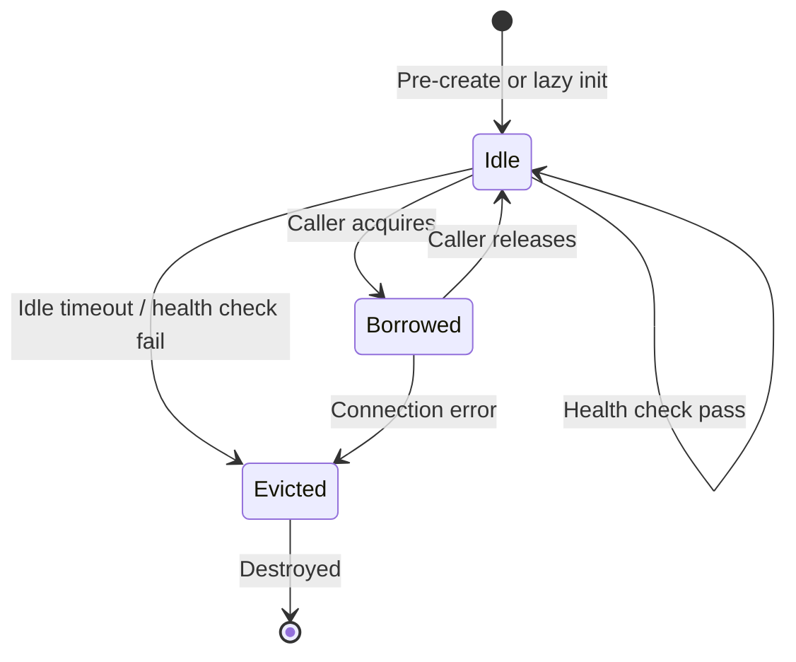

# Connection Pooling as a General Pattern

Connection pooling is not specific to databases. It's a general pattern that applies
anywhere opening a connection is expensive.

**Core idea**: keep a set of connections alive and reuse them instead of
open/use/close every time.

## The Universal Shape

Every connection pool, regardless of what it pools, follows the same structure:

1. Pre-create N connections (or create lazily on first use)
2. When someone needs a connection, borrow one from the pool
3. When done, return it to the pool (don't close it)
4. Handle edge cases: max size, idle timeout, health checks, what to do when pool is exhausted



## Where You See It

### Database Connections
TCP + auth + memory allocation per connection. What the rest of these notes cover.

### HTTP Connections
TCP handshake + TLS handshake is expensive. Connection pools reuse the underlying
TCP/TLS connection across multiple HTTP requests.

**Python:**
```python
import requests

# Without pooling -- new TCP+TLS handshake per request
requests.get("https://api.example.com/users/1")
requests.get("https://api.example.com/users/2")

# With pooling -- reuses the connection
session = requests.Session()
session.get("https://api.example.com/users/1")
session.get("https://api.example.com/users/2")  # same underlying TCP connection
```

**Go:**
```go
// Go's http.Client pools connections by default via http.Transport
client := &http.Client{
    Transport: &http.Transport{
        MaxIdleConns:        100,              // total idle connections across all hosts
        MaxIdleConnsPerHost: 10,               // idle connections per host
        IdleConnTimeout:     90 * time.Second, // close idle connections after this
    },
}

// Both requests reuse the same underlying TCP+TLS connection
client.Get("https://api.example.com/users/1")
client.Get("https://api.example.com/users/2")
```

### Thread Pools
Creating OS threads is expensive. A thread pool keeps worker threads alive
and assigns tasks to them.

**Python:**
```python
from concurrent.futures import ThreadPoolExecutor

# Pool of 10 threads -- reused across all submitted tasks
with ThreadPoolExecutor(max_workers=10) as pool:
    future1 = pool.submit(do_work, arg1)
    future2 = pool.submit(do_work, arg2)  # reuses a thread, doesn't create a new one
```

**Go:**
```go
// Go doesn't need traditional thread pools because goroutines are cheap.
// But worker pools are still common to limit concurrency:
jobs := make(chan Job, 100)

// Start 10 workers (analogous to a thread pool)
for i := 0; i < 10; i++ {
    go func() {
        for job := range jobs {
            process(job)
        }
    }()
}
```

### gRPC Channels
gRPC multiplexes RPCs over HTTP/2 connections, but you can pool multiple
channels for higher throughput.

```go
// Pool of gRPC connections
conns := make([]*grpc.ClientConn, 5)
for i := range conns {
    conns[i], _ = grpc.Dial("server:50051", grpc.WithInsecure())
}

// Round-robin across pooled connections
func getConn() *grpc.ClientConn {
    return conns[atomic.AddUint64(&counter, 1) % uint64(len(conns))]
}
```



```mermaid
graph LR
    subgraph "Same Pattern, Different Resources"
        direction TB
        A[HTTP Pool] -->|manages| A1[TCP/TLS Sockets]
        B[DB Pool] -->|manages| B1[Postgres/MySQL Sockets]
        C[Thread Pool] -->|manages| C1[OS Thread Handles]
        D[gRPC Pool] -->|manages| D1[HTTP/2 Connections]
    end
    style A fill:#2d2d2d,stroke:#888
    style B fill:#2d2d2d,stroke:#888
    style C fill:#2d2d2d,stroke:#888
    style D fill:#2d2d2d,stroke:#888
```

## Do They Share Implementation?

The pattern is the same but implementations are completely different because the
"connection" being pooled is different:

- A DB pool manages sockets speaking the Postgres/MySQL wire protocol
- An HTTP pool manages sockets with TLS state
- A thread pool manages OS thread handles
- A gRPC pool manages HTTP/2 connections

What they DO share is the **pool management logic** -- tracking which connections
are borrowed, which are idle, when to create new ones, when to evict stale ones.
That logic is the same data structure regardless of what's being pooled.

Some languages have generic pool libraries you can wrap around any resource type:

- **Java**: Apache Commons Pool -- generic object pooling, used by DBCP under the hood
- **Go**: common to roll your own with channels or `sync.Pool` (though `sync.Pool` is for temporary objects, not long-lived connections)
- **Python**: no standard generic pool, but the pattern is the same everywhere

**Summary**: same pattern, same pool management logic, different connection lifecycles
(create, validate, destroy) specific to each protocol.
