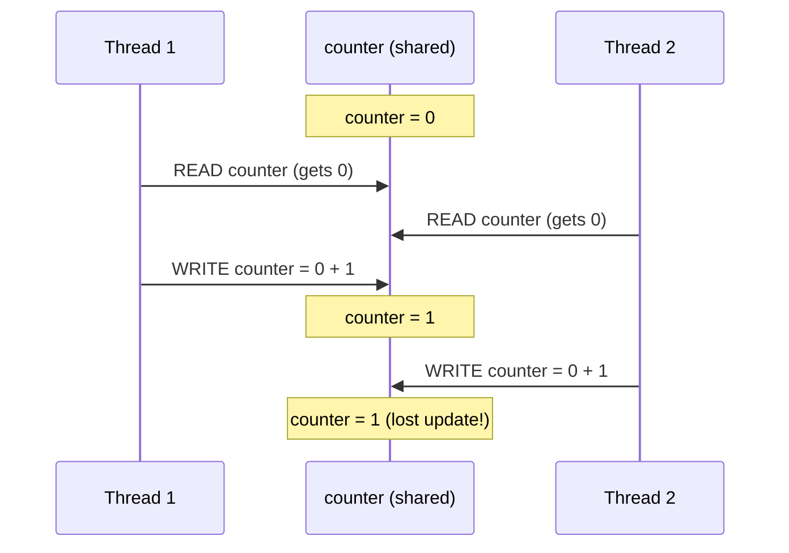
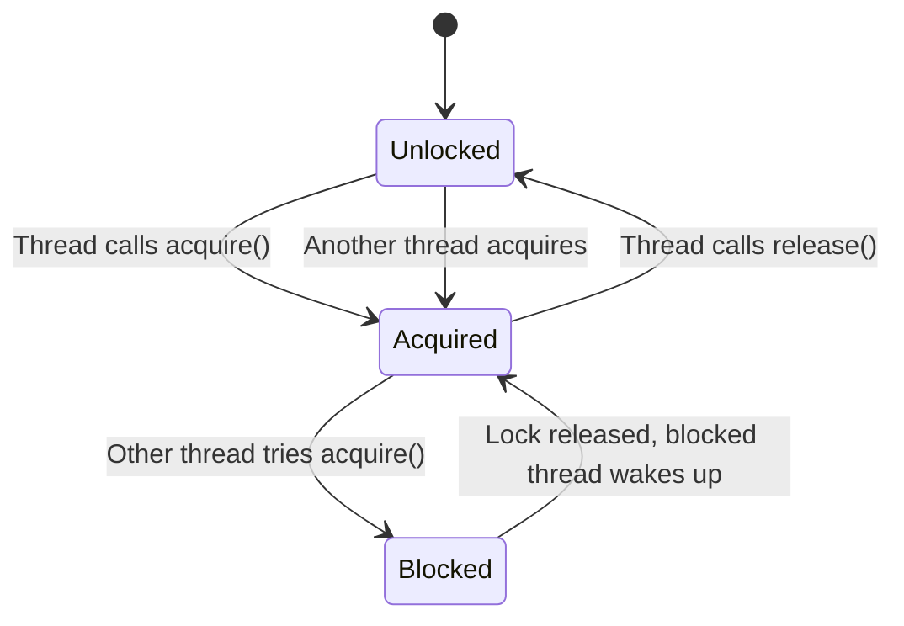

# Threads, Locks, and Race Conditions

Key concepts:

- Threads share memory within a process (unlike processes which are isolated)
- Shared state + multiple threads = race conditions
- Locks (`threading.Lock`) control access to shared state
- `with lock:` is a context manager that auto acquires/releases
- Minimize the critical section (locked code) -- keep it fast

See [01-threads-and-locks.py](https://github.com/atolat/the-grind/blob/main/python-deep-dive/01-threads-and-locks.py) for runnable code.

## Race Condition

`counter += 1` is NOT atomic. It's actually: read → add → write.
Two threads can read the same value, both add 1, both write back = lost update.



```python
counter = 0

def increment_unsafe():
    global counter
    for _ in range(1_000_000):
        counter += 1  # NOT atomic

t1 = threading.Thread(target=increment_unsafe)
t2 = threading.Thread(target=increment_unsafe)
t1.start(); t2.start(); t1.join(); t2.join()
print(counter)  # less than 2,000,000!
```

## Fix 1: Use a Lock



```python
lock = threading.Lock()

def increment_safe():
    global counter
    for _ in range(1_000_000):
        with lock:
            counter += 1  # only one thread at a time
```



```mermaid
sequenceDiagram
    participant T1 as Thread 1
    participant L as Lock
    participant C as counter (shared)
    participant T2 as Thread 2

    T1->>L: acquire()
    activate L
    Note over L: LOCKED
    T2->>L: acquire()
    Note over T2: BLOCKED (waiting)
    rect rgb(50, 50, 80)
        Note over T1,C: Critical Section
        T1->>C: READ counter
        T1->>C: WRITE counter + 1
    end
    T1->>L: release()
    deactivate L
    Note over L: UNLOCKED
    L->>T2: acquired!
    activate L
    rect rgb(50, 50, 80)
        Note over T2,C: Critical Section
        T2->>C: READ counter
        T2->>C: WRITE counter + 1
    end
    T2->>L: release()
    deactivate L
```

Downside: if ALL the work is inside the lock, you've made it sequential again.

## Fix 2: Avoid Shared State

```python
def increment_isolated(results, index):
    local_counter = 0
    for _ in range(1_000_000):
        local_counter += 1
    results[index] = local_counter

results = [0, 0]
# each thread writes to its own index, combine at the end
print(sum(results))  # exactly 2,000,000
```
