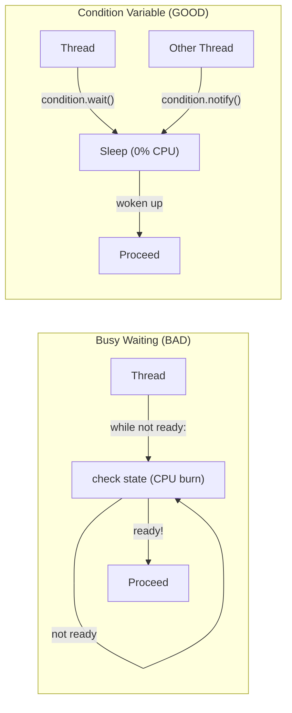
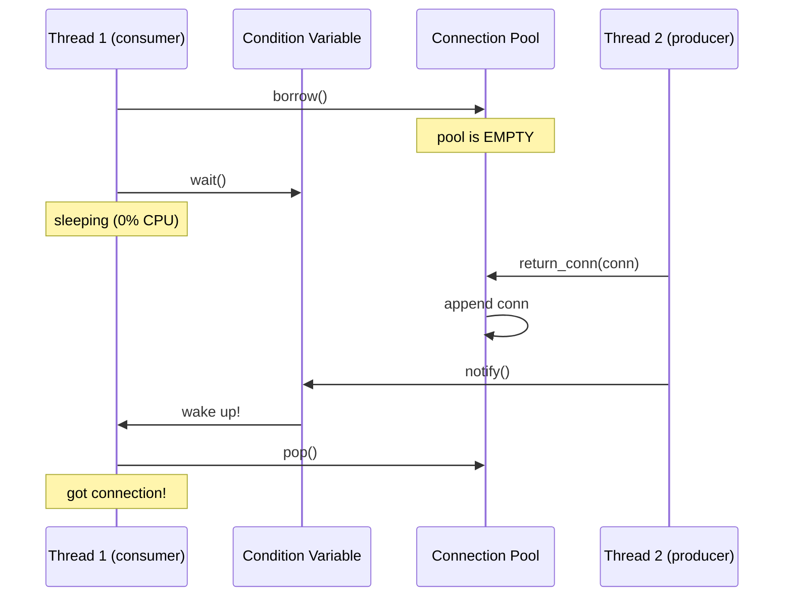
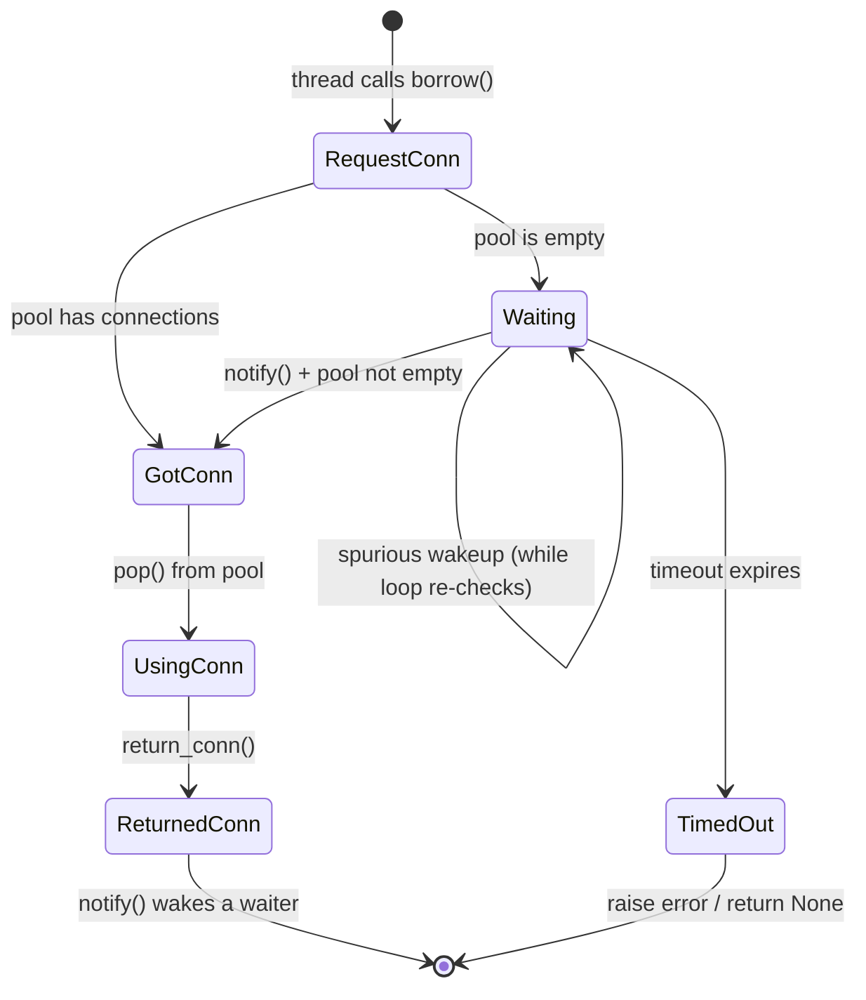

# Condition Variables and Wait/Notify

Key concepts:

- Busy waiting (while loop checking state) wastes CPU
- `threading.Condition` lets a thread sleep until notified (zero CPU)
- `condition.wait()` = release lock + sleep (atomic)
- `condition.notify()` = wake up one sleeping thread
- ALWAYS use `while` (not `if`) around `wait()` -- spurious wakeups



<small>[Run this code locally](https://github.com/atolat/the-grind/blob/main/python-deep-dive/02-condition-variables.py) or try snippets in the [Playground](../playground.md).</small>

## Connection to System Design

This is how connection pools work internally:

- Thread requests a connection, pool is empty → sleep via `wait()`
- Another thread returns a connection → `notify()` wakes up the waiter
- `pool_timeout=30` in SQLAlchemy = wait with a 30-second timeout



## Simple Connection Pool

```python
import threading
import time

class SimpleConnectionPool:
    def __init__(self, size):
        self.pool = [f"conn_{i}" for i in range(size)]
        self.condition = threading.Condition()

    def borrow(self, timeout=None):
        with self.condition:
            while len(self.pool) == 0:       # while, not if! (spurious wakeups)
                notified = self.condition.wait(timeout=timeout)
                if not notified:             # timed out
                    raise TimeoutError("No connection available")
            return self.pool.pop()           # grab a connection

    def return_conn(self, conn):
        with self.condition:
            self.pool.append(conn)
            self.condition.notify()          # wake up ONE waiting thread
```



## Demo: 3 Threads, 2 Connections

Thread C will sleep until A or B returns their connection:

```python
pool = SimpleConnectionPool(size=2)  # only 2 connections

def worker(name, delay):
    print(f"{name}: waiting for connection...")
    conn = pool.borrow(timeout=10)
    print(f"{name}: got {conn}")
    time.sleep(delay)  # simulate query work (NO lock held during this)
    print(f"{name}: returning {conn}")
    pool.return_conn(conn)

# 3 threads, but only 2 connections
threads = [
    threading.Thread(target=worker, args=("Thread-A", 1)),
    threading.Thread(target=worker, args=("Thread-B", 2)),
    threading.Thread(target=worker, args=("Thread-C", 1)),
]

for t in threads:
    t.start()
for t in threads:
    t.join()

print("All done.")
```

## Anti-Pattern: Busy Waiting

```python
def borrow_busy_wait(pool_list):
    """Burns CPU checking in a tight loop. Wastes resources."""
    while len(pool_list) == 0:
        pass  # spinning, checking millions of times per second
    return pool_list.pop()
```

Never do this. Use `condition.wait()` instead.
