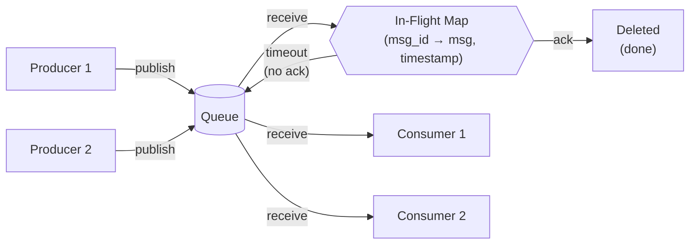
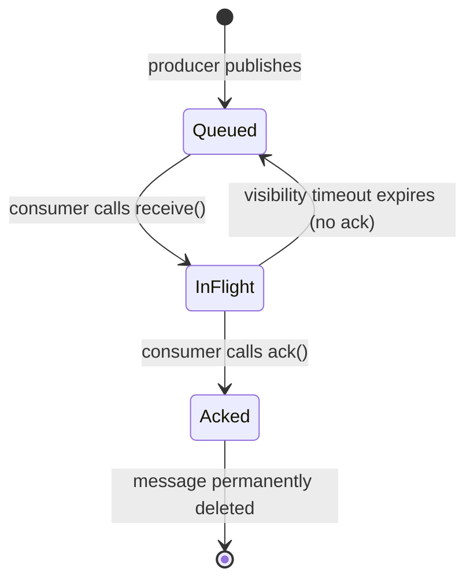
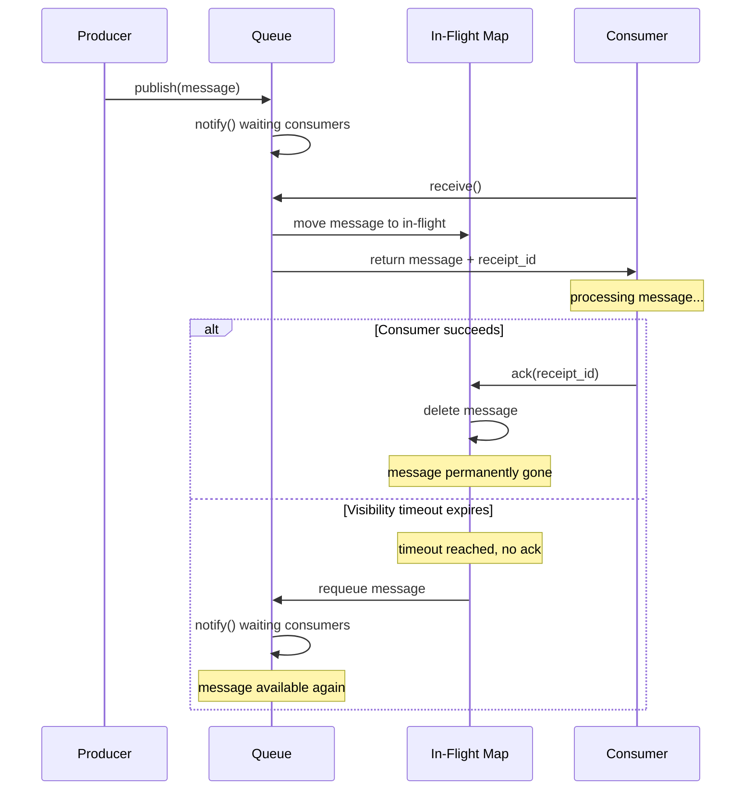

# Simple Message Queue Implementation

Concepts exercised:

- `threading.Lock`, `threading.Condition` (from 01 and 02)
- Dataclasses
- Ack-based delivery, visibility timeout, redelivery
- Producer/consumer pattern

See [03-simple-message-queue.py](https://github.com/atolat/the-grind/blob/main/python-deep-dive/03-simple-message-queue.py) for runnable code.

## Design

A message queue with ack-based delivery:

1. Producer publishes messages to the queue
2. Consumer receives a message (moved to "in flight", invisible to others)
3. Consumer processes and sends ack (message deleted permanently)
4. If no ack within visibility timeout, message reappears in queue



```
Borrow: acquire lock → pop from queue → add to in_flight → release lock → process
Ack:    acquire lock → remove from in_flight → release lock
Requeue: acquire lock → check timestamps → move expired back to queue → notify → release lock
```





## Key Decisions

- **Single lock** for both queue and in_flight dict, because operations cross both
  (receive reads queue + writes dict, requeue reads dict + writes queue)
- **`wait_for`** instead of manual `wait()` + check loop -- handles spurious wakeups cleanly
- **Dict for in_flight** -- maps message ID → (message, timestamp) for timeout checking
