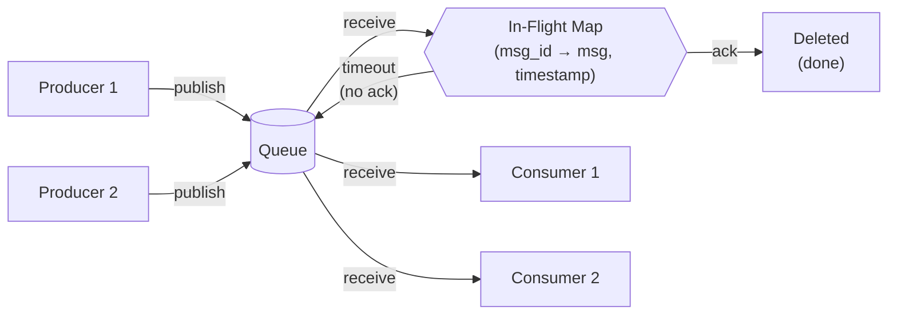
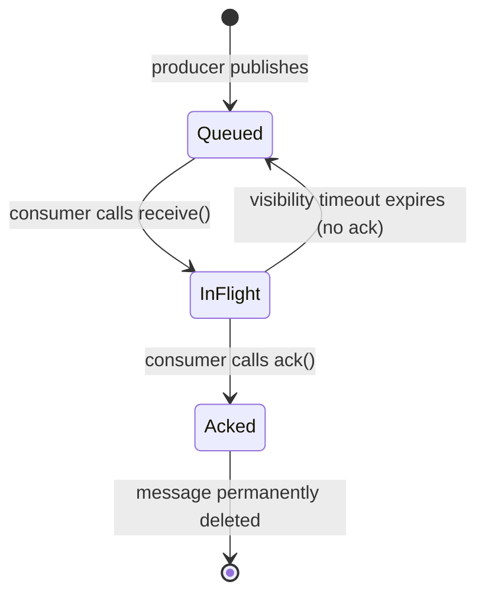
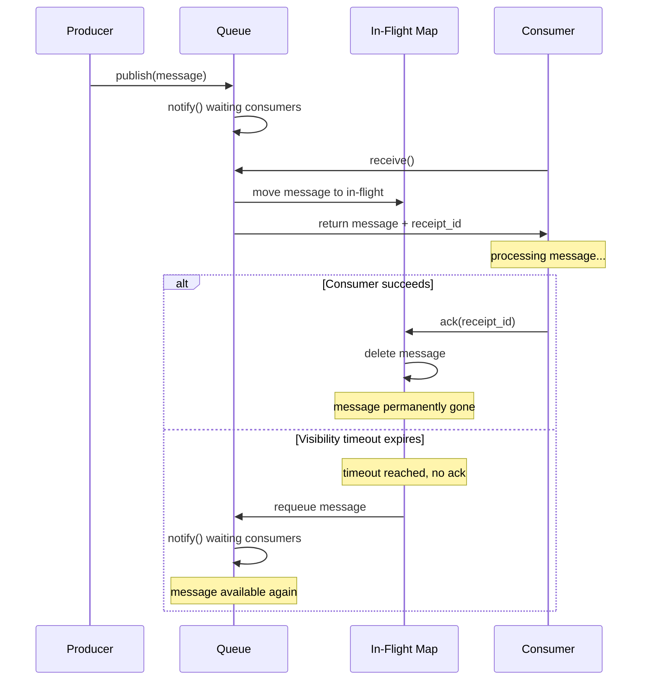

# Simple Message Queue Implementation

Concepts exercised:

- `threading.Lock`, `threading.Condition` (from 01 and 02)
- Dataclasses
- Ack-based delivery, visibility timeout, redelivery
- Producer/consumer pattern

<small>[Run this code locally](https://github.com/atolat/the-grind/blob/main/python-deep-dive/03-simple-message-queue.py) or try snippets in the [Playground](../playground.md).</small>

## Design

A message queue with ack-based delivery:

1. Producer publishes messages to the queue
2. Consumer receives a message (moved to "in flight", invisible to others)
3. Consumer processes and sends ack (message deleted permanently)
4. If no ack within visibility timeout, message reappears in queue



```
Borrow: acquire lock → pop from queue → add to in_flight → release lock → process
Ack:    acquire lock → remove from in_flight → release lock
Requeue: acquire lock → check timestamps → move expired back to queue → notify → release lock
```





## Implementation

### Message dataclass

```python
from collections import deque
import threading
import time
import uuid
from dataclasses import dataclass


@dataclass
class Message:
    id: str
    body: str
```

### SimpleQueue class

```python
class SimpleQueue:
    def __init__(self, visibility_timeout: float = 5.0):
        self.queue: deque[Message] = deque()
        self.in_flight: dict[str, tuple[Message, float]] = {}  # msg_id → (message, handed_out_time)
        self.visibility_timeout = visibility_timeout
        self.lock = threading.Lock()
        self.condition = threading.Condition(self.lock)

    def publish(self, body: str) -> str:
        """Create a message and add it to the queue. Return the message id."""
        with self.lock:
            message = Message(id=str(uuid.uuid4()), body=body)
            self.queue.append(message)
            self.condition.notify_all()
            return message.id

    def receive(self, timeout: float = 10.0) -> Message | None:
        """Wait for a message, move it to in_flight, return it. Return None on timeout."""
        with self.lock:
            got_message = self.condition.wait_for(
                lambda: len(self.queue) > 0,
                timeout=timeout
            )
            if not got_message:
                return None
            message = self.queue.popleft()
            self.in_flight[message.id] = (message, time.time())
            return message

    def ack(self, message_id: str) -> None:
        """Acknowledge a message -- remove it from in_flight permanently."""
        with self.lock:
            del self.in_flight[message_id]

    def requeue_expired(self) -> None:
        """Check in_flight messages. If any exceeded visibility_timeout, move back to queue."""
        to_delete = []
        with self.lock:
            for message_id, (message, handed_out_time) in self.in_flight.items():
                if time.time() - handed_out_time > self.visibility_timeout:
                    self.queue.appendleft(message)
                    to_delete.append(message_id)
            for message_id in to_delete:
                del self.in_flight[message_id]
            self.condition.notify_all()
```

### Test harness

```python
q = SimpleQueue(visibility_timeout=3.0)

def producer():
    """Publish 3 messages to the queue, with a small delay between each."""
    q.publish("message 1")
    q.publish("message 2")
    q.publish("message 3")

def good_consumer(name: str):
    """Receive a message, simulate work (sleep 1s), then ack."""
    while (message := q.receive(timeout=10.0)):
        print(f"{name} received message {message.body}")
        time.sleep(1)
        q.ack(message.id)
    print(f"{name} received no message")

def bad_consumer(name: str):
    """Receive a message, simulate crash (never ack). Just print and return."""
    message = q.receive()
    if message:
        print(f"{name} received message {message.body}")
        time.sleep(1)
    else:
        print(f"{name} received no message")

def requeue_monitor():
    for _ in range(5):
        time.sleep(2)
        print("Requeueing expired messages")
        q.requeue_expired()

if __name__ == "__main__":
    threads = [
        threading.Thread(target=producer),
        threading.Thread(target=good_consumer, args=("good-1",)),
        threading.Thread(target=bad_consumer, args=("bad-1",)),
        threading.Thread(target=good_consumer, args=("good-2",)),
        threading.Thread(target=requeue_monitor),
    ]
    for t in threads:
        t.start()
    for t in threads:
        t.join()

    print(f"\nFinal state:")
    print(f"  Queue: {list(q.queue)}")
    print(f"  In-flight: {q.in_flight}")
```

## Key Decisions

- **Single lock** for both queue and in_flight dict, because operations cross both
  (receive reads queue + writes dict, requeue reads dict + writes queue)
- **`wait_for`** instead of manual `wait()` + check loop -- handles spurious wakeups cleanly
- **Dict for in_flight** -- maps message ID → (message, timestamp) for timeout checking
- **`to_delete` list in `requeue_expired`** -- can't delete from dict while iterating
  (Python raises `RuntimeError: dictionary changed size during iteration`)
- **`notify_all` in `requeue_expired`** -- multiple messages may be requeued, wake all
  waiting consumers. `notify` (one) is fine in `publish` since only one message was added
