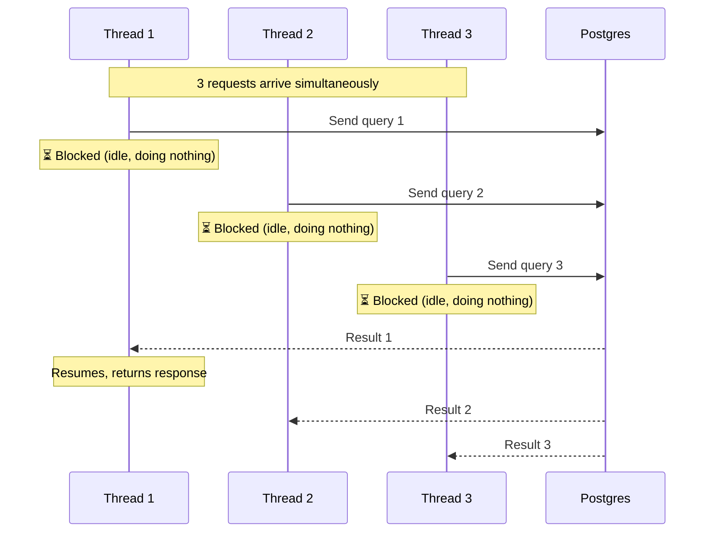
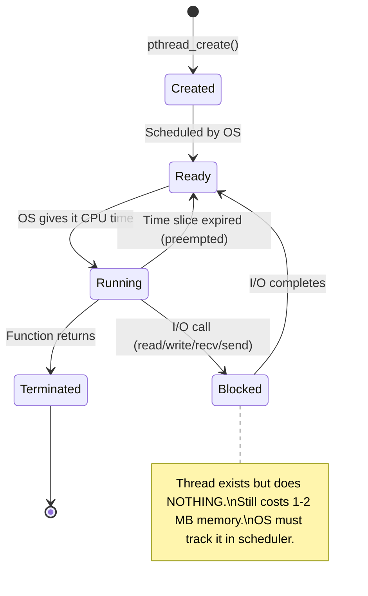
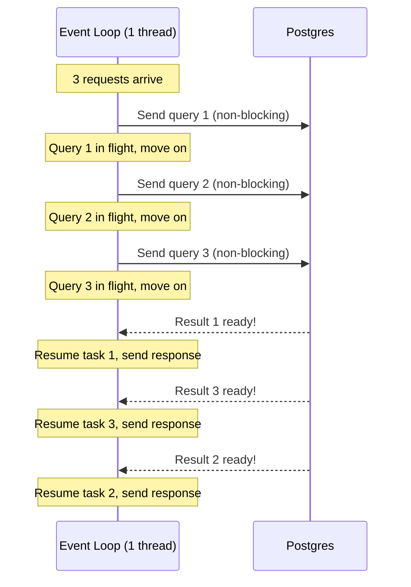
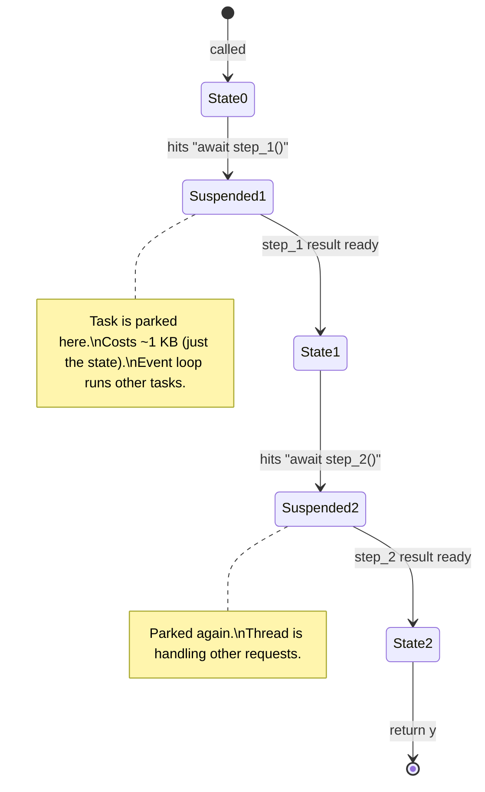
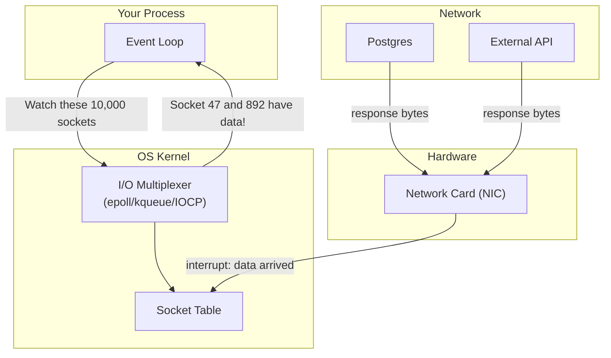
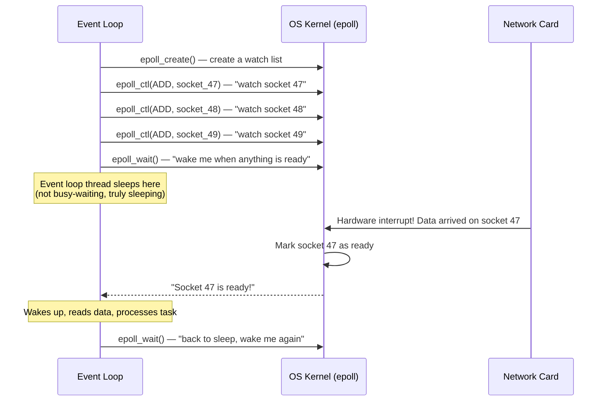

```mermaid
flowchart TD
    A["Ask OS: any I/O ready?<br/>(epoll/kqueue)"] --> B{"Events?"}
    B -->|Yes| C["Move tasks:<br/>WAITING → READY"]
    B -->|No| A
    C --> D["Pick next READY task"]
    D --> E["Run until next await"]
    E --> F{"Task status?"}
    F -->|"Hit await"| G["Park task in WAITING"]
    F -->|"Finished"| H["Send response, clean up"]
    G --> D
    H --> D
    D -->|"No more ready tasks"| A

    style A fill:#1a3a4a,stroke:#44aaff
    style G fill:#4a3a1a,stroke:#ffaa44
    style H fill:#1a4a1a,stroke:#44ff44
```

# Async, Event Loops & OS I/O

Understanding what actually happens under the hood when you write `await` — from your
Python code all the way down to the OS kernel and hardware.

---

## The Core Problem: Waiting is Wasteful

Most server applications spend the majority of their time **waiting**:

- Waiting for a database to respond (~3-5ms)
- Waiting for an HTTP API call (~50-500ms)
- Waiting for disk reads (~0.1-1ms)
- Waiting for a client to send data (~variable)

The actual computation (parsing, building queries, formatting responses) takes
**microseconds**. The question is: what does the thread do during those milliseconds
of waiting?

```mermaid
graph LR
    subgraph "Timeline of a DB request"
        A["Build query<br/>0.01ms"] --> B["⏳ Wait for DB<br/>4ms"] --> C["Parse result<br/>0.01ms"]
    end

    style B fill:#4a1a1a,stroke:#ff4444
    style A fill:#1a4a1a,stroke:#44ff44
    style C fill:#1a4a1a,stroke:#44ff44
```



**99.5% of the time is spent waiting.** Two models exist to handle this.

---

## Model 1: Thread Per Request (Synchronous)

Each request gets its own OS thread. The thread runs the request from start to finish.

```python
# Synchronous — thread blocks during I/O
def get_key(key: str):
    conn = pool.get_connection()        # might block waiting for a free connection
    row = conn.execute("SELECT ...")    # BLOCKS for 4ms waiting on Postgres
    return row                          # thread was idle for 4ms
```



### What an OS Thread Costs

| Resource | Cost per thread |
|----------|----------------|
| Stack memory | 1-2 MB (reserved by OS on creation) |
| Kernel data structures | ~8 KB (tracked by OS scheduler) |
| Context switch | ~1-5 µs (save/restore registers, flush caches) |

**At 1000 concurrent requests:** 1000 threads × 2 MB = **2 GB** of memory, just for thread
stacks. Plus thousands of context switches per second.

**At 10,000 concurrent requests:** most OSes can't even create that many threads.
This is the **C10K problem** — handling 10,000 concurrent connections.

### Thread Lifecycle



---

## Model 2: Event Loop (Asynchronous)

One thread handles **all** requests. It never blocks — when it would need to wait
for I/O, it suspends the current task and runs another one.

```python
# Asynchronous — task suspends during I/O, thread stays busy
async def get_key(key: str):
    conn = await pool.acquire()          # suspend if no connection ready
    row = await conn.fetch("SELECT ...")  # suspend, thread handles other requests
    return row                            # resumed when DB responded
```



**One thread. Zero idle time. Microseconds of memory per task instead of megabytes.**

---

## What is a Task (Coroutine)?

A regular function runs to completion. A coroutine can **suspend and resume**.

```python
# Regular function — runs start to finish, can't pause
def do_work():
    x = step_1()     # must complete before step_2
    y = step_2(x)    # caller waits for entire function
    return y

# Coroutine — can pause at each "await"
async def do_work():
    x = await step_1()    # PAUSE here, resume when step_1 finishes
    y = await step_2(x)   # PAUSE here, resume when step_2 finishes
    return y
```

Under the hood, Python compiles a coroutine into a **state machine**:



### Cost Comparison: Thread vs Coroutine

| | OS Thread | Coroutine (Task) |
|---|---|---|
| Memory | 1-2 MB (stack) | ~1 KB (state object) |
| Creation time | ~50 µs (system call) | ~1 µs (Python object) |
| Context switch | ~1-5 µs (OS scheduler) | ~0.1 µs (Python function call) |
| Managed by | OS kernel | Python event loop |
| At 10,000 concurrent | ~20 GB memory | ~10 MB memory |

---

## The Event Loop: The Bookkeeper

The event loop is a **while loop** that:

1. Checks if any I/O is ready (asks the OS)
2. Wakes up tasks whose I/O completed
3. Runs ready tasks until they hit the next `await`
4. Repeat

```python
# Simplified event loop (what asyncio does internally)
class EventLoop:
    def __init__(self):
        self.ready = deque()     # tasks ready to run NOW
        self.waiting = {}        # task → socket it's waiting on

    def run_forever(self):
        while True:
            # 1. Ask OS: "Any I/O events ready?"
            events = self.selector.select()  # calls epoll/kqueue

            # 2. Move tasks from waiting → ready
            for socket, event_type in events:
                task = self.waiting.pop(socket)
                self.ready.append(task)

            # 3. Run all ready tasks
            while self.ready:
                task = self.ready.popleft()
                result = task.run_until_next_await()

                if task.is_waiting_on_io():
                    # Task hit an "await" — park it
                    self.waiting[task.socket] = task
                elif task.is_done():
                    # Task finished — send response to client
                    task.send_response()
```



---

## OS-Level I/O: How the Kernel Helps

The event loop doesn't poll sockets one by one. It uses OS kernel facilities
designed for exactly this problem.

### Blocking vs Non-Blocking I/O

When your program opens a network socket (connection to Postgres, HTTP client, etc.),
the OS provides two modes:

**Blocking mode (default):**
```
recv(socket)  →  thread STOPS here until data arrives
                 OS removes thread from CPU scheduler
                 thread does absolutely nothing
                 data arrives → OS wakes up thread
```

**Non-blocking mode:**
```
recv(socket)  →  data available? return it immediately
                 no data yet? return EAGAIN ("try again later")
                 thread keeps running, never stops
```

Async frameworks set sockets to **non-blocking mode** and use I/O multiplexing
to know *when* to try again.

### I/O Multiplexing: Watching Many Sockets at Once

The OS provides system calls that let you say: "Here are 10,000 sockets.
Tell me which ones have data."



### Platform-Specific Implementations

| OS | System Call | How it Works |
|----|-----------|-------------|
| **Linux** | `epoll` | Kernel maintains a watch list. You add/remove sockets. `epoll_wait()` blocks until ANY socket has data. Returns only the ready ones. O(1) per event. |
| **macOS/BSD** | `kqueue` | Similar to epoll. Kernel event queue. `kevent()` returns ready events. Also handles file system events, signals, timers. |
| **Windows** | `IOCP` (I/O Completion Ports) | Different model: "proactive" I/O. You start an async read, OS completes it and notifies you. Used by .NET, Node.js on Windows. |

All three solve the same problem: **watch many sockets, wake me when any are ready**.

### The `epoll` Flow (Linux)



### Before epoll: `select()` and `poll()`

Older systems used `select()` which scans ALL sockets every time:

```
select(): "Check all 10,000 sockets. Which ones are ready?"
           → scans 1, 2, 3, ... 10,000. Only #47 is ready.
           → O(n) every time. SLOW at scale.

epoll():  "Anything ready?"
           → "Yes, socket 47."
           → O(1) per event. Fast regardless of total socket count.
```

This is why Nginx (epoll) handles 10,000+ connections while Apache (thread-per-request
with select) struggled at that scale.

---

## The Full Stack: From `await` to Hardware

Here's what happens when you write `row = await conn.fetch(query)`:

```mermaid
graph TD
    subgraph "Layer 4: Your Code"
        A["row = await conn.fetch(query)"]
    end

    subgraph "Layer 3: asyncpg (DB Driver)"
        B["Serialize query to bytes"]
        C["Write bytes to socket (non-blocking)"]
        D["Register socket with event loop"]
    end

    subgraph "Layer 2: asyncio (Event Loop)"
        E["Park this coroutine in WAITING"]
        F["Run other ready coroutines"]
        G["Call epoll_wait()"]
        H["Socket ready → move coroutine to READY"]
    end

    subgraph "Layer 1: OS Kernel"
        I["TCP/IP stack sends packets"]
        J["epoll watches socket"]
        K["NIC hardware interrupt → data arrived"]
        L["epoll marks socket ready"]
    end

    subgraph "Layer 0: Hardware & Network"
        M["NIC sends electrical signals"]
        N["Switches, routers forward packets"]
        O["Postgres NIC receives query"]
        P["Postgres executes query"]
        Q["Postgres sends response packets back"]
    end

    A --> B --> C --> D --> E --> F
    F --> G --> J
    Q --> N --> K --> L --> H
    H --> A

    I --> M --> N --> O --> P --> Q

    style A fill:#1a4a1a,stroke:#44ff44
    style E fill:#4a3a1a,stroke:#ffaa44
    style F fill:#1a3a4a,stroke:#44aaff
    style K fill:#4a1a4a,stroke:#ff44ff
```



**Step by step:**

| Step | Layer | What Happens |
|------|-------|-------------|
| 1 | Your code | `await conn.fetch(query)` |
| 2 | asyncpg | Serializes the SQL query into PostgreSQL wire protocol bytes |
| 3 | asyncpg | Writes bytes to the TCP socket (non-blocking, returns immediately) |
| 4 | OS kernel | TCP/IP stack sends packets out through the NIC |
| 5 | Hardware | NIC converts to electrical signals, network delivers to Postgres |
| 6 | Postgres | Receives query, executes it, sends response packets |
| 7 | Hardware | Response travels back over network to your NIC |
| 8 | OS kernel | NIC triggers hardware interrupt → "data arrived on socket 47" |
| 9 | OS kernel | epoll marks socket 47 as ready |
| 10 | asyncio | `epoll_wait()` returns → moves your coroutine to READY queue |
| 11 | asyncio | Event loop runs your coroutine from where it suspended |
| 12 | asyncpg | Reads response bytes, deserializes into Python objects |
| 13 | Your code | `row` now has the result, execution continues |

**Key insight:** Steps 4-9 involve **zero threads from your process**. The OS kernel,
network hardware, and Postgres handle all of it. Your single event loop thread is
free to serve other requests during that entire time.

---

## When NOT to Use Async

Async is **not** a silver bullet. It helps only when the bottleneck is **I/O waiting**.

| Workload | Async helps? | Why |
|----------|-------------|-----|
| Web server hitting a DB | ✅ Yes | Mostly waiting on DB responses |
| API gateway proxying requests | ✅ Yes | Mostly waiting on upstream services |
| Chat server | ✅ Yes | Mostly waiting on messages from clients |
| Image processing | ❌ No | CPU-bound: thread is doing math, not waiting |
| ML model inference | ❌ No | CPU/GPU-bound |
| Password hashing (bcrypt) | ❌ No | CPU-bound: intentionally slow |

**If you use CPU-heavy code inside an `async def` without `await`, you block the
entire event loop:**

```python
async def bad_endpoint():
    # This hashes for 200ms ON THE EVENT LOOP THREAD
    # Every other request freezes for 200ms!
    hashed = bcrypt.hash(password)  # no await = blocking!
    return hashed
```

**Fix:** Run CPU-bound work in a thread pool:
```python
async def good_endpoint():
    # Offload to thread pool, event loop stays free
    hashed = await asyncio.to_thread(bcrypt.hash, password)
    return hashed
```

---

## Comparison: Python asyncio vs Go goroutines

Since you know Go, this mapping might help:

| Concept | Python (asyncio) | Go |
|---------|-----------------|-----|
| Lightweight task | Coroutine (`async def`) | Goroutine (`go func()`) |
| Suspend point | `await` (explicit) | Any I/O call (implicit) |
| Scheduler | asyncio event loop (single-threaded) | Go runtime (multi-threaded, `GOMAXPROCS`) |
| Must mark functions? | Yes: `async def` + `await` everywhere | No: all functions work the same |
| Thread usage | 1 thread (event loop) + optional thread pool | M:N scheduling (many goroutines on few OS threads) |

Go's big advantage: goroutines are **implicitly async**. You don't need to write
`async`/`await` — the Go runtime automatically suspends goroutines at I/O points.
Python requires you to explicitly opt in with `async`/`await` through the entire
call chain.

```python
# Python: async is "viral" — every caller must be async too
async def get_key():
    row = await fetch_from_db()     # must await
    return process(row)

async def handler():
    result = await get_key()        # caller must await too
    return result
```

```go
// Go: just write normal code, runtime handles suspension
func getKey() Row {
    row := fetchFromDB()  // runtime suspends goroutine here automatically
    return process(row)
}

func handler() {
    result := getKey()    // no special syntax needed
    return result
}
```

---

## Summary

```mermaid
graph TD
    subgraph "The Big Picture"
        U["User Request"] --> T{"Sync or Async?"}

        T -->|"Sync (def)"| TH["Thread Pool<br/>40 threads<br/>1 thread per request"]
        T -->|"Async (async def)"| EL["Event Loop<br/>1 thread<br/>thousands of tasks"]

        TH --> IO1["Thread blocks on I/O<br/>Idle for milliseconds<br/>Memory: ~2 MB per thread"]
        EL --> IO2["Task suspends on await<br/>Thread runs other tasks<br/>Memory: ~1 KB per task"]

        IO1 --> OS["OS Kernel + Hardware<br/>Does the actual I/O work<br/>(network, disk)"]
        IO2 --> OS

        OS --> R["Response ready"]
        R -->|Sync| TH2["OS wakes up the blocked thread"]
        R -->|Async| EL2["epoll notifies event loop<br/>Task moved to READY queue"]
    end

    style IO1 fill:#4a1a1a,stroke:#ff4444
    style IO2 fill:#1a4a1a,stroke:#44ff44
```



**Key takeaways:**

1. **Threads don't do I/O work** — the OS kernel and hardware do
2. **Blocking I/O** = thread sits idle, wasting memory, while waiting for the OS
3. **Non-blocking I/O + event loop** = thread stays busy, OS notifies when I/O completes
4. **`await`** = "suspend this task, I'll come back when the I/O is done"
5. **epoll/kqueue** = OS facility to watch thousands of sockets efficiently
6. **Async helps I/O-bound work** (web servers, DB clients). Not CPU-bound work.
7. **Go does this implicitly**. Python makes you write `async`/`await` explicitly.
