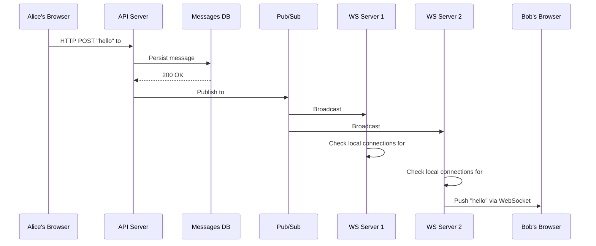

# Design: Slack's Realtime Communication (Text)

## Requirements

- Multiple users, multiple channels
- Users can DM or message in channels
- Real-time chat delivery
- Historical messages can be scrolled through

**Similar systems:** Any realtime chat, realtime polls, creator tools, live interactions.

---

## Data Model

### Tables

```sql
users:      u_id, name, ...
channels:   c_id, type (dm/channel), name, ...
messages:   m_id, channel_id, sender_id, text, timestamp
membership: user_id, channel_id, is_muted, is_starred, ...
```

**Key insight:** DMs are modeled as channels with exactly 2 members. One code path for everything — no separate DM table, no separate fanout logic.

### Messages DB

- **Partition key:** `channel_id` — all messages for a channel on the same shard
- **Sort key:** `timestamp` — messages pre-sorted by time, range scans are free
- Historical message retrieval via REST: `GET /ch/{channel_id}/msgs?p=1`

---

## 3 Patterns for Message Communication

| Pattern | How It Works | Example |
|---|---|---|
| **1. Persist first, then deliver** | Write to DB → on success → fan out via WS | Slack (persistence is critical) |
| **2. Deliver first, persist async** | Send via WS → async worker persists to DB | WhatsApp (local persistence on device) |
| **3. Realtime only, no persistence** | Send via WS → never persisted | Zoom chat, Google Meet chat |

**Slack uses pattern 1** — if you can see a message, it's guaranteed to be saved. No "ghost messages" that disappear on refresh.

---

## Why Not HTTP Polling?

With plain HTTP, the client has to poll for new messages:

```
Bob's browser: GET /messages?channel=general&since=<timestamp>  (every 2 seconds)
Server: "nothing new" / "here's 3 new messages"
```

At Slack's scale: 10M users × poll every 2 sec = **5 million requests/second**, most returning empty responses. Massive waste of bandwidth and server resources.

**Solution:** Keep a persistent, bidirectional connection open — **WebSockets**.

---

## WebSockets: The Fundamentals

A WebSocket starts as a normal HTTP request, then **upgrades** to a persistent TCP connection:

```
Client                          Server
  |                                |
  |--- HTTP GET /chat  ---------->|
  |    Upgrade: websocket          |
  |                                |
  |<-- HTTP 101 Switching --------|
  |    Protocols                   |
  |                                |
  |================================|  ← persistent TCP connection
  |   full duplex: both sides      |
  |   can send at any time         |
  |================================|
```

After the upgrade, **either side can send at any time** — no request/response cycle. The connection stays open for minutes, hours, or days.

### What the server holds per connection

Each WS server maintains in-memory state for every connected user:

```
connection_id: ws-39281
user_id: "bob"
channels: ["general", "random", "engineering"]
socket_fd: 47
```

This is **socket membership** — semi-persistent state (lives in memory, lost if the server restarts).

---

## The Full Message Flow (Slack's Architecture)

The client maintains **two separate connections**:

1. **HTTP** → API server (for sending messages, loading history)
2. **WebSocket** → WS server (for receiving real-time pushes)



### Why two paths?

- **HTTP for sending** = request/response, guaranteed ack, retryable. Alice knows the message was saved.
- **WebSocket for receiving** = fire-and-forget push, fast. Bob sees it instantly.

### Why persist first?

If we fan out before persisting and the DB write fails:

- Bob **saw** the message
- Alice **thinks** it was sent
- But it's **not in the database**
- Both refresh → message is gone (ghost message)

Persist-first guarantee: **if you can see it, it's saved.**

---

## Fanout: Pub/Sub Broadcast

When a message is persisted, the API server publishes to a pub/sub system (Redis Pub/Sub or similar). **All WS servers** receive it:

```
API Server: "new message in #general"
        │
        ▼
   Pub/Sub (Redis)
        │
   ┌────┼────┐
   ▼    ▼    ▼
 WS1  WS2  WS3    ← all receive it
  │    │    │
  └→ each checks local socket membership
     "do any of my connections care about #general?"
     if yes → push down the WebSocket
```

**Broadcast vs targeted delivery:**

- **Broadcast to all** — simple, no state to maintain. Wasteful for small DM channels, but for popular channels almost every WS server has a member.
- **Registry lookup** — efficient (only notify relevant WS servers), but requires keeping a connection registry in sync. More complexity for marginal gain at Slack's scale.

Slack uses broadcast within "pockets" (see scaling section below).

---

## Non-Delivery of Realtime Messages

WebSocket delivery is best-effort. What if Bob's connection drops right when the message is being pushed?

**Solution: Client-side checkpoints.**

The client tracks the timestamp of the last message it received. On reconnect:

```
GET /messages?channel=general&since=<last_seen_timestamp>
```

The DB is the **source of truth**. The WebSocket is a real-time optimization. If it fails, the client catches up via HTTP.

This is why persist-first matters — the data is always there waiting.

---

## Scaling WebSockets: Pockets

A single WS server can handle ~60K persistent connections. At Slack's scale (millions of users), you need many WS servers.

### The Pocket Architecture

Instead of broadcasting to ALL WS servers globally, organize them into **pockets** — groups of WS servers that share a pub/sub bus:

```mermaid
graph TD
    CB["Connection Balancer"] --> P1["Pocket 1<br/>(Workspace: Acme Corp)<br/>wss1, wss2, ... wss100"]
    CB --> P2["Pocket 2<br/>(Workspace: BigCo)<br/>wss101, ... wss200"]

    P1 --- PS1["Redis Pub/Sub<br/>(Pocket 1)"]
    P2 --- PS2["Redis Pub/Sub<br/>(Pocket 2)"]

    style CB fill:#4a3a1a,stroke:#ffaa44
    style PS1 fill:#1a4a1a,stroke:#44ff44
    style PS2 fill:#1a4a1a,stroke:#44ff44
```



**Key insight:** A Slack workspace rarely exceeds 60K members. So one pocket (a handful of WS servers) can serve an entire workspace. The pub/sub broadcast only goes to servers within the pocket, not globally.

**Connection Balancer** routes a user to the correct pocket based on their workspace.

Within a pocket, the message service knows the **topology** — which WS servers hold connections for which channels — so it can target even more precisely.

---

## The 64K Port "Myth"

A TCP connection is identified by a 4-tuple: `(src_ip, src_port, dst_ip, dst_port)`

**With a Load Balancer in front:**

```
LB_IP:port1 → Server:443
LB_IP:port2 → Server:443
...
LB_IP:port65535 → Server:443   ← capped at ~64K (one source IP)
```

**Direct client connections (no LB):**

```
Client1_IP:port → Server:443
Client2_IP:port → Server:443
Client3_IP:port → Server:443   ← millions possible (unique 4-tuples)
```

WhatsApp handles ~2-3 million connections per server using direct connections. The real bottleneck becomes memory and file descriptors, not ports.

**The tradeoff:** Removing the LB means WS servers are "naked on the internet" — they must handle DDoS protection, TLS termination, and authentication themselves. This is a hard security problem that WhatsApp has solved.

---

## Real-World Architecture Details

### Slack's Internal Services

| Service | Role |
|---|---|
| **Channel Servers** | Hold channel state, mapped via consistent hashing on channel_id |
| **Gateway Servers** | The WS servers — geo-distributed across AWS regions |
| **Flannel** | Edge cache that solved the boot problem (see below) |
| **Presence Servers** | Track who is online (the green dot) |

**Flannel** — when a client connects, it needs workspace state (channels, members, unread counts). Originally this was a giant payload. Flannel caches this at regional edge nodes — 44x payload reduction for large workspaces (~32K users).

### Discord's Cassandra → ScyllaDB Migration

Discord stored messages in Cassandra with `partition_key = (channel_id, time_bucket)`. It worked until:

- **Hot partitions** — viral announcements in huge servers = millions reading same partition
- **Java GC pauses** — caused latency spikes requiring manual node reboots

They migrated to **ScyllaDB** (Cassandra-compatible, C++, no GC) and built a **request coalescing** layer: if 1000 users request the same channel's messages, the DB is queried only once.

Result: 177 Cassandra nodes → 72 ScyllaDB nodes, p99 read latency 40-125ms → 15ms.

### WhatsApp's Erlang Architecture

WhatsApp achieves millions of connections per server using **Erlang**:

- Each connection = one Erlang process (~300 bytes of memory)
- Not OS threads, not goroutines — Erlang's native lightweight processes
- The "naive" approach (one process per connection) IS the efficient approach in Erlang
- Erlang was built for telecom switches — fault isolation is built in

**Lesson:** Sometimes choosing the right runtime eliminates entire categories of complexity.

---

## Recommended Reading

- [Real-time Messaging — Slack Engineering](https://slack.engineering/real-time-messaging/)
- [Flannel: Application-Level Edge Cache — Slack Engineering](https://slack.engineering/flannel-an-application-level-edge-cache-to-make-slack-scale/)
- [Migrating Millions of WebSockets to Envoy — Slack Engineering](https://slack.engineering/migrating-millions-of-concurrent-websockets-to-envoy/)
- [How Discord Stores Trillions of Messages](https://discord.com/blog/how-discord-stores-trillions-of-messages)

---

## Topics for Later

- WebSocket implementation in Python (asyncio + websockets library)
- Long polling and Server-Sent Events (SSE) as alternatives to WebSockets
- Edge server security — DDoS protection, TLS termination at the WS layer
- Presence system design (the "online" green dot)
- Message ordering and consistency in distributed chat
