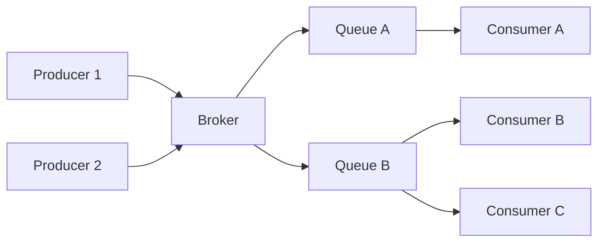
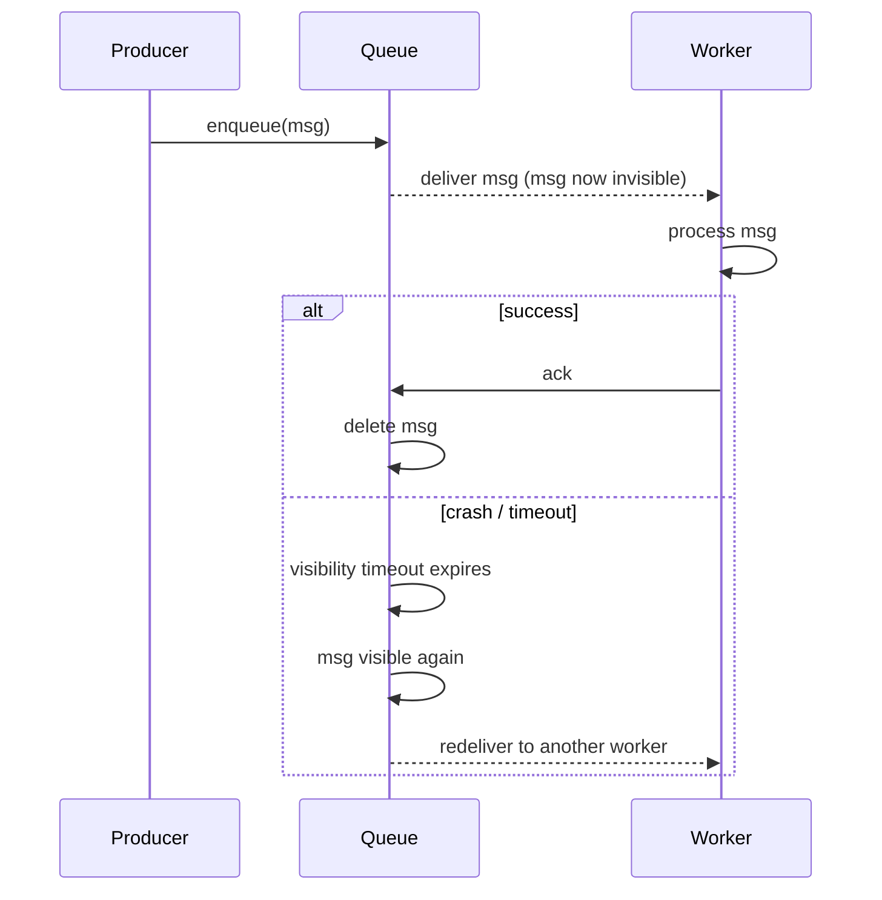
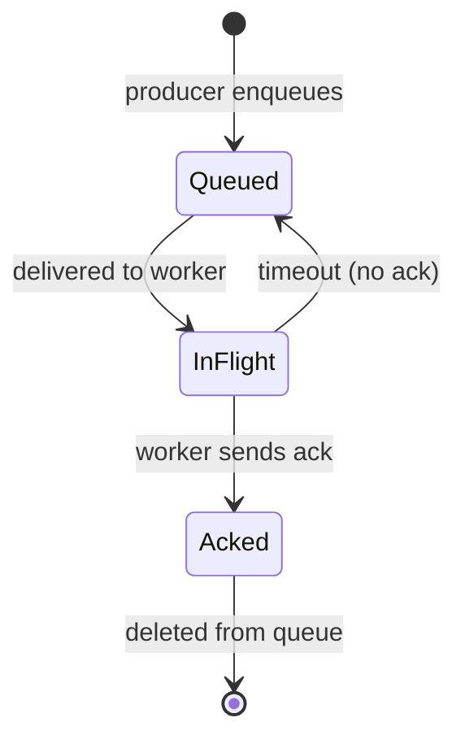
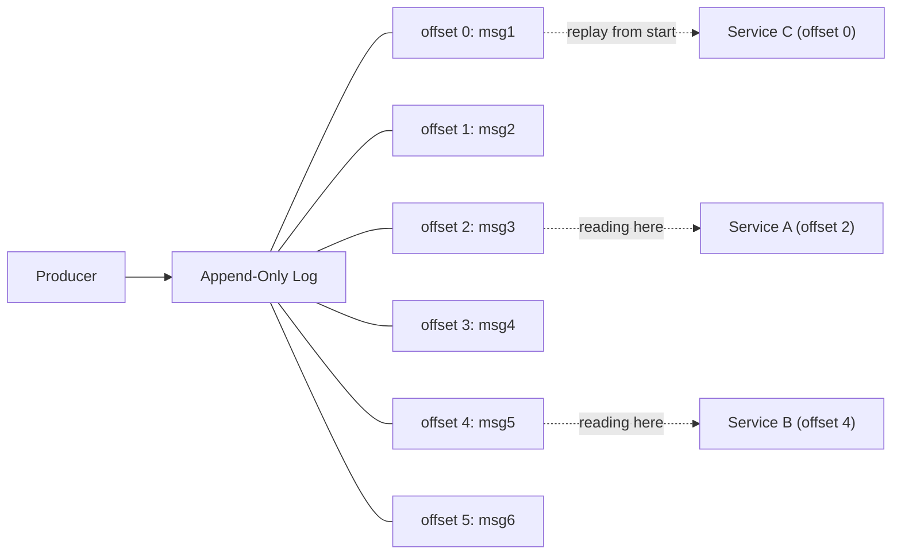
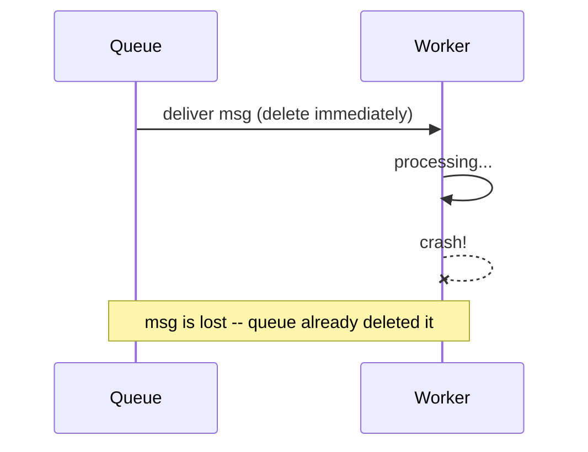
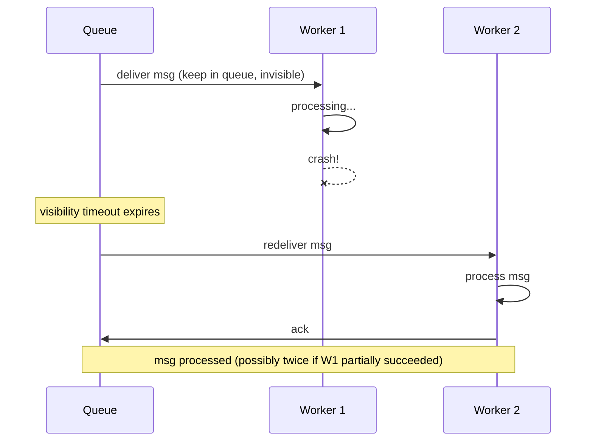
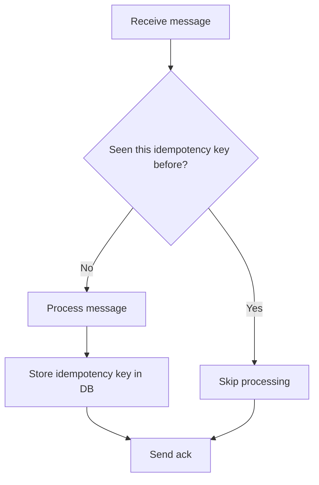

# Message Queues, Brokers, and Streams

## The Problem: Synchronous Work in Request Handlers

User places an order. The API handler needs to:
1. Save the order to DB
2. Charge payment
3. Send confirmation email
4. Update inventory
5. Notify warehouse

If done synchronously, the user waits 5-10 seconds. If step 4 fails, steps 1-3
already ran. The user only needs to know "order placed" -- the rest can happen later.

**Delegation**: hand off work to be done later, by someone else.

```
Without delegation:
  User → API: do steps 1-5 → wait... wait... → "done"

With delegation:
  User → API: do step 1, hand off 2-5 → "done" (fast)
                                ↓
                    workers pick up 2-5 in the background
```

## Why Not Just Background Threads?

Two problems:
1. **Durability** -- if the app server crashes, in-memory tasks are lost forever
2. **Scale** -- 100 users × 5 background tasks = resource exhaustion

A queue is external to the application. Work survives crashes.

```
Background thread:  app memory: [task1, task2] → crash → all lost
Queue:              app → writes to Queue → crash → tasks still in queue → another worker picks up
```

## Terminology

- **Broker** = the system that sits between producers and consumers (RabbitMQ, Kafka, SQS)
- **Queue** = a delivery pattern (consume and delete)
- **Stream** = a delivery pattern (consume and retain)

A broker can implement queues, streams, or both.

```
Without broker (tightly coupled):
  Producer → Consumer A
  Producer → Consumer B    (producer must know all consumers)

With broker (decoupled):
  Producer → Broker → Consumer A
                    → Consumer B   (producer doesn't care who consumes)
```



## Queue Model

Messages are deleted once consumed. One message → one consumer.

```
[msg1, msg2, msg3]  →  consumer reads msg1  →  [msg2, msg3]  (msg1 gone)
```

### Acknowledgments (Acks)

Queues don't just pop messages. They use ack-based delivery:

1. Worker receives message (message becomes invisible to others, NOT deleted)
2. Worker processes it
3. Worker sends ack ("done, delete it")

If worker crashes before acking, the queue waits for a visibility timeout,
then makes the message visible again for another worker.

```
Worker 1: receives msg1 → msg1 invisible → crash!
                           (timeout expires)
                         → msg1 visible again
Worker 2: receives msg1 → processes → ack → msg1 deleted
```





### Fan-Out (Multiple Services)

If multiple services need the same message, each gets its own queue:

```
                    ┌──→  Queue A  →  Order Service
Producer → Broker   ┤
                    ├──→  Queue B  →  Email Service
                    └──→  Queue C  →  Analytics Service
```

RabbitMQ supports this with "exchanges" that copy messages into multiple queues.

**Tools**: RabbitMQ, Amazon SQS, Redis (with lists), Azure Service Bus

## Stream Model

Messages stay after consumption. Consumers track their own position (offset).
Multiple consumers read the same messages independently. Any consumer can rewind.

```
[msg1, msg2, msg3, msg4, msg5, msg6, ...]
                              ↑              ↑
                  Service A (offset 4)    Service B (offset 6)
                  ↑
       New Service C (offset 0) -- reads everything from the start
```

No fan-out configuration needed. New service just starts reading the same topic.



**Tools**: Apache Kafka, Amazon Kinesis, Redpanda, Apache Pulsar

## Queue vs Stream -- When to Use Which

| Aspect                             | Queue (RabbitMQ, SQS) | Stream (Kafka)          |
|------------------------------------|-----------------------|-------------------------|
| Message consumed once?             | Yes (per queue)       | No, stays around        |
| New consumer needs history?        | Gone                  | Start from any offset   |
| Multiple services, same message?   | Fan-out (separate Qs) | Same topic              |
| Simple task delegation?            | Great fit             | Overkill                |
| Event sourcing / audit trail?      | Not designed for it   | Perfect                 |

## Delivery Guarantees

### At-Most-Once
Queue deletes message on handover. No ack. If worker crashes, message is lost.
Fast but lossy.



### At-Least-Once
Queue redelivers if no ack received (visibility timeout). Never loses messages,
but worker might process the same message twice.



### Exactly-Once
True exactly-once is impossible between two independent systems. The queue can't
know if the worker finished but the ack was lost, or if the worker genuinely crashed.

**Solution**: at-least-once delivery + idempotent consumers = effectively exactly-once.

```
at-least-once delivery + idempotent processing = effectively exactly-once
```

When Kafka claims "exactly-once semantics," it handles idempotency tracking internally.

## Idempotency Patterns

Since at-least-once delivery means duplicates are possible, workers must be idempotent:

```
NOT idempotent (dangerous):
  "Add $50 to balance" → processed twice = $100

Idempotent (safe):
  "Set order #123 status to SHIPPED" → twice = still SHIPPED
  "Charge with idempotency_key=abc" → payment provider rejects duplicate
```

Common patterns:
- **Idempotency keys** -- unique ID per message, check before processing
- **Upserts** -- "insert or update if exists" instead of "insert"
- **State transitions** -- "set status to X" not "increment counter"


