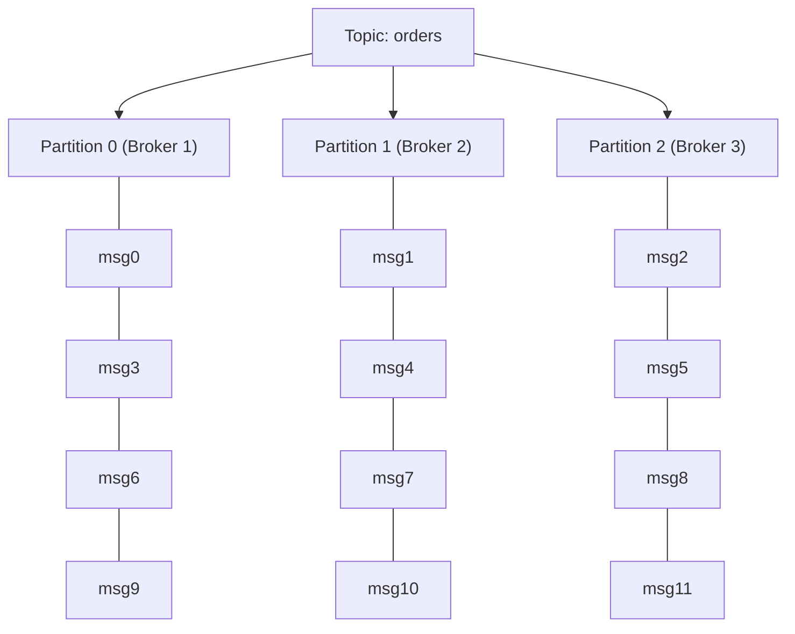
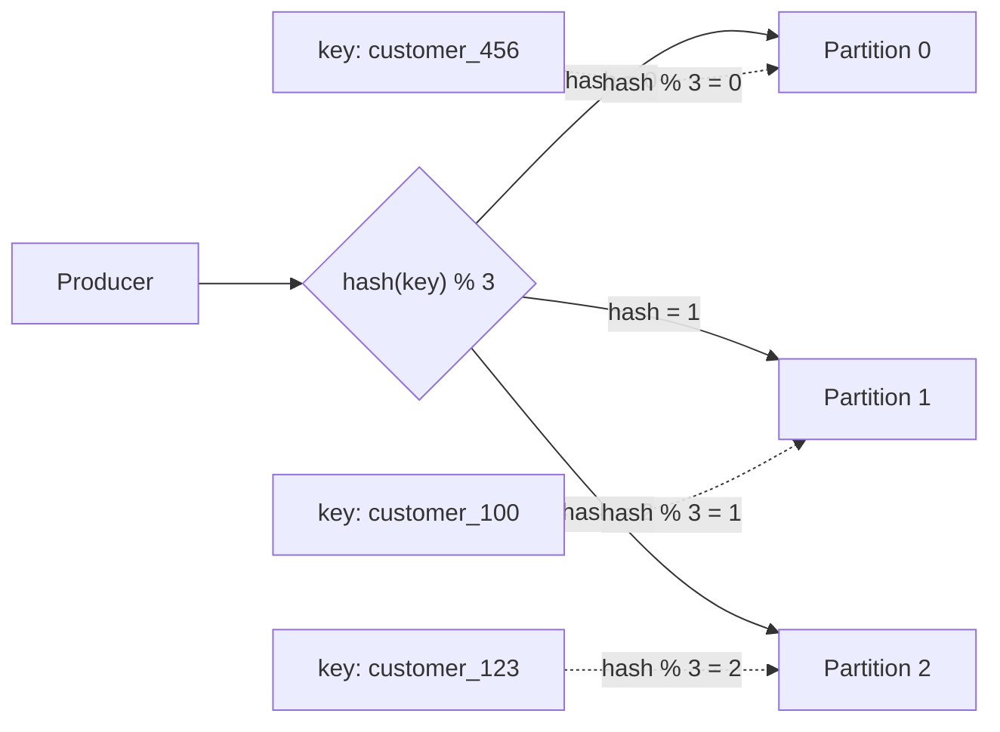
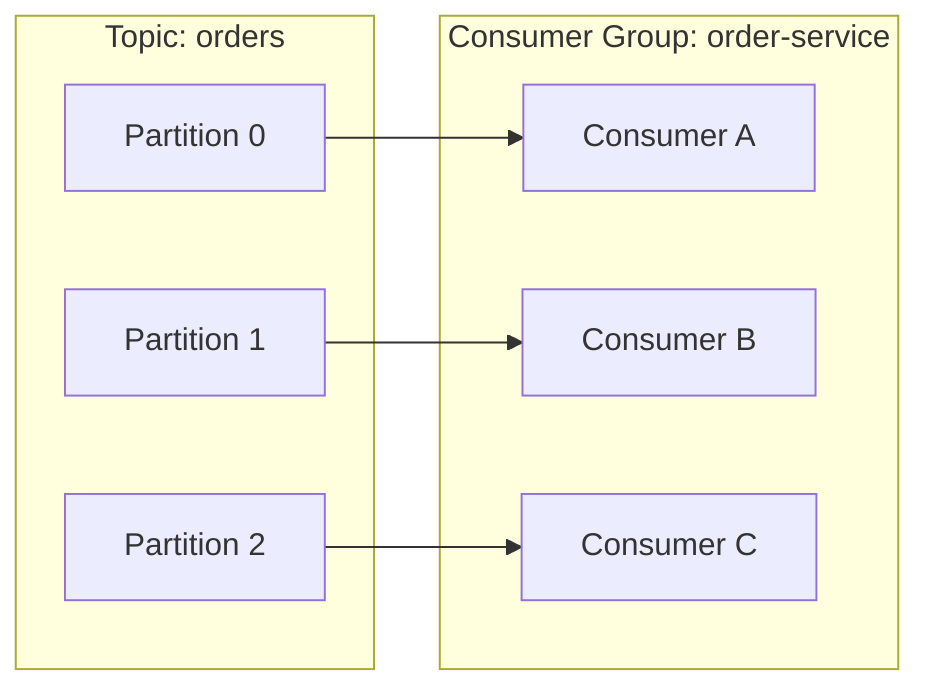
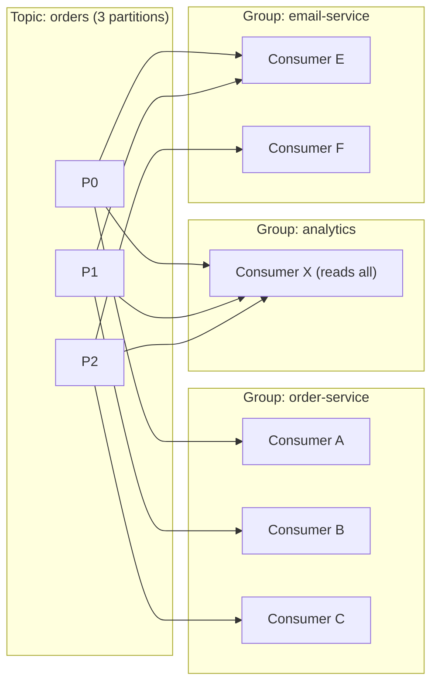
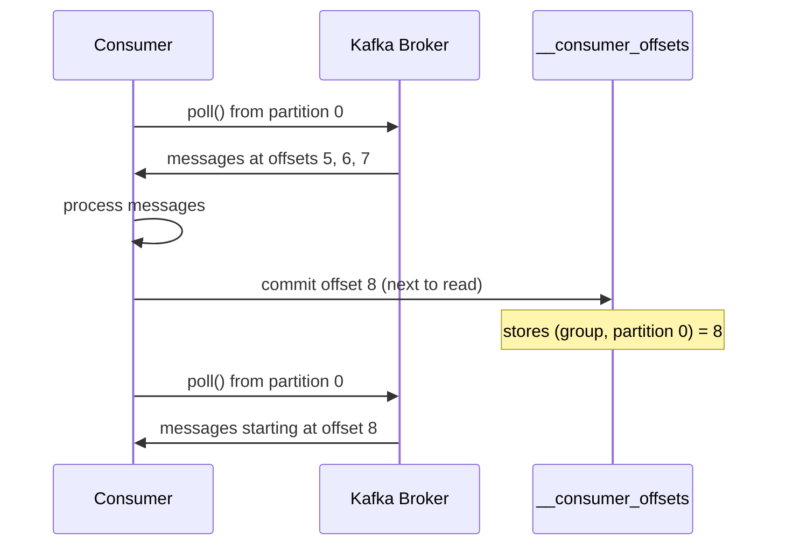
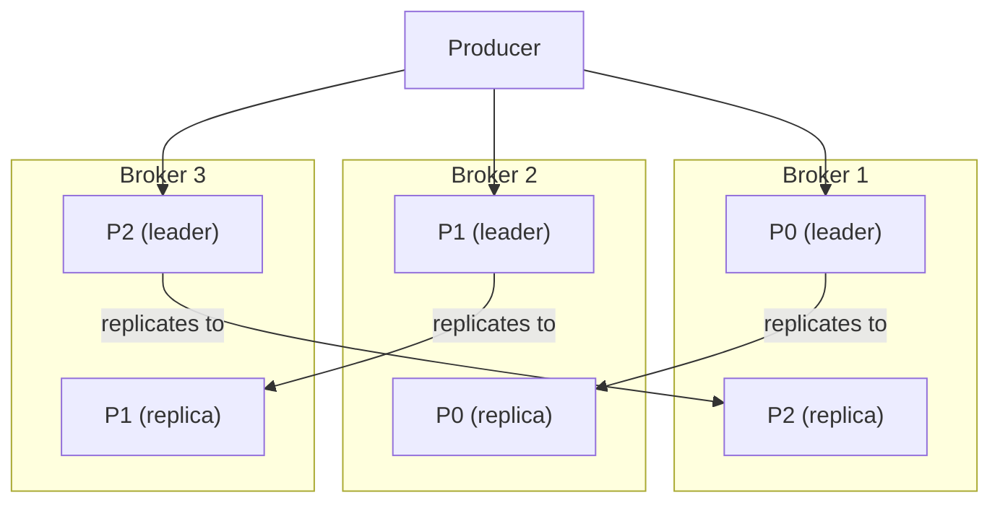

# Kafka Architecture

## Core Concept: The Append-Only Log

Everything in Kafka is built on one idea: an append-only log. You never delete,
never update. Only append. Consumers move their pointer (offset) forward.

```
Topic: "orders"

offset:  0       1       2       3       4       5
       [order1][order2][order3][order4][order5][order6]
                                  ↑                    ↑
                          Consumer reads here     new writes go here
```

Messages are retained for a configurable period (hours, days, forever),
regardless of whether anyone consumed them.

## Partitions: Scaling the Log

A single log on one machine can't handle 100k messages/second. Kafka splits
topics into **partitions** -- separate append-only logs spread across multiple
machines (brokers).

```
Topic: "orders" (3 partitions)

Broker 1:   Partition 0  [msg0][msg3][msg6][msg9] ...
Broker 2:   Partition 1  [msg1][msg4][msg7][msg10] ...
Broker 3:   Partition 2  [msg2][msg5][msg8][msg11] ...
```



### Partition Assignment

Producers decide which partition a message goes to:

```
partition = hash(message_key) % num_partitions
```

Example: hash("customer_123") % 3 = 2, so all orders for customer_123
land in Partition 2.



### Why Key-Based Partitioning?

**Ordering is guaranteed within a partition, NOT across partitions.**

```
Key-based (customer_123 always → Partition 2):
  create → pay → ship → deliver  (all in Partition 2, ordered) ✓

Round-robin (customer_123 scattered):
  create → Partition 0
  pay    → Partition 1
  ship   → Partition 2
  deliver→ Partition 0
  Consumer might process: pay → create → ship → deliver  ✗
```

If ordering doesn't matter (logs, metrics), round-robin is fine and gives
better load distribution.

### Partition Count = Max Parallelism

The number of partitions sets the upper limit on consumer parallelism within
a consumer group. 3 partitions = at most 3 active consumers.
- 4 consumers with 3 partitions → 1 consumer sits idle (standby)
- Choose partition count carefully: too few = can't scale, too many = overhead

## Consumer Groups

Multiple consumers form a **consumer group**. Kafka assigns each partition to
exactly one consumer in the group.

```
Consumer Group: "order-service"

Consumer A (machine 1)  ←──  Partition 0
Consumer B (machine 2)  ←──  Partition 1
Consumer C (machine 3)  ←──  Partition 2
```



### All Consumers in a Group Run the Same Code

Each consumer is a separate process, typically on a separate machine/container.
Same code, different instances. Scale by adding more processes.

```
Machine 1: python order_service.py   →  Consumer A (reads Partition 0)
Machine 2: python order_service.py   →  Consumer B (reads Partition 1)
Machine 3: python order_service.py   →  Consumer C (reads Partition 2)
```

### Different Groups = Different Services

Different consumer groups read the same topic independently, each maintaining
their own offsets.

```
Group "order-service":   processes orders    (3 instances)
Group "analytics":       aggregates metrics  (1 instance)
Group "email-service":   sends notifications (2 instances)

All read the same "orders" topic. No fan-out configuration needed.
```



### Rebalancing

If a consumer dies (detected via heartbeat timeout), Kafka redistributes
its partition to a surviving consumer:

```
Before:
  Consumer A ← Partition 0
  Consumer B ← Partition 1    ← dies
  Consumer C ← Partition 2

After rebalance:
  Consumer A ← Partition 0, Partition 1   ← picks up B's work
  Consumer C ← Partition 2
```



### Threading Model

The Kafka consumer client is NOT thread-safe. Typical patterns:

```
Recommended (simple):
  1 process = 1 consumer = 1 thread polling
  Scale by running more processes (Kubernetes replicas)

Alternative (when processing is slow):
  1 process = 1 consumer polling → dispatches to thread pool
  Polling thread fetches, worker threads process
  Tradeoff: more throughput, but ack/offset management gets complex
```

## Replication

Each partition has a leader and replicas across brokers (same as DB
primary/replica concept):

```
Broker 1:  Partition 0 (leader)   | Partition 2 (replica)
Broker 2:  Partition 1 (leader)   | Partition 0 (replica)
Broker 3:  Partition 2 (leader)   | Partition 1 (replica)
```

- Producers write to the leader
- Replicas are for fault tolerance
- If a broker dies, a replica is promoted to leader



## Full Architecture

```
Producers                    Kafka Cluster                     Consumer Groups

                    ┌────────────────────────────┐
                    │  Broker 1                  │
 Producer A ──────→ │    Partition 0 (leader)     │ ──→  Group "order-service"
                    │    Partition 2 (replica)    │        Consumer A ← P0
                    ├────────────────────────────┤        Consumer B ← P1
                    │  Broker 2                  │        Consumer C ← P2
 Producer B ──────→ │    Partition 1 (leader)     │
                    │    Partition 0 (replica)    │     Group "analytics"
                    ├────────────────────────────┤        Consumer X ← P0,P1,P2
                    │  Broker 3                  │
                    │    Partition 2 (leader)     │
                    │    Partition 1 (replica)    │
                    └────────────────────────────┘
```
